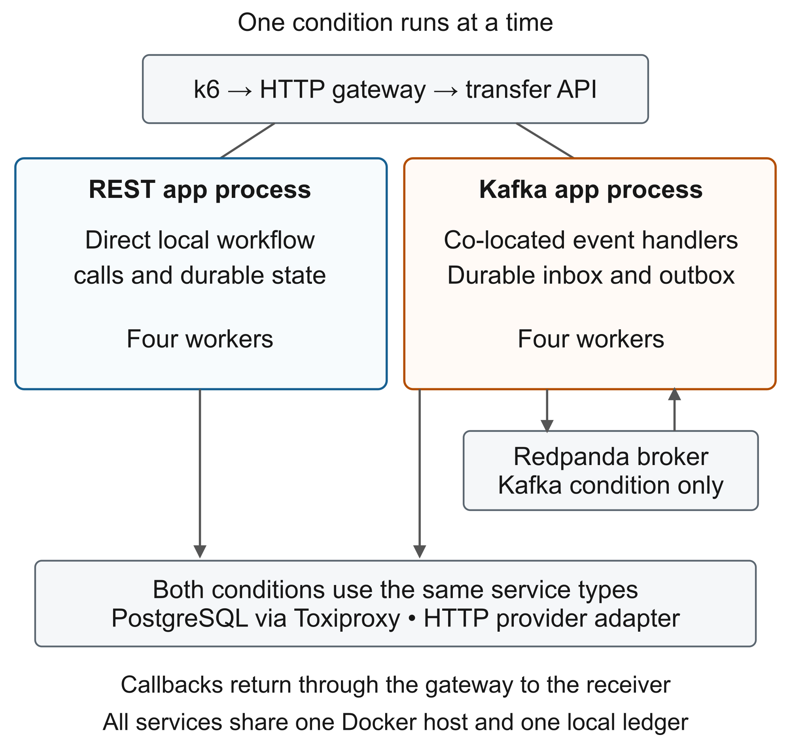
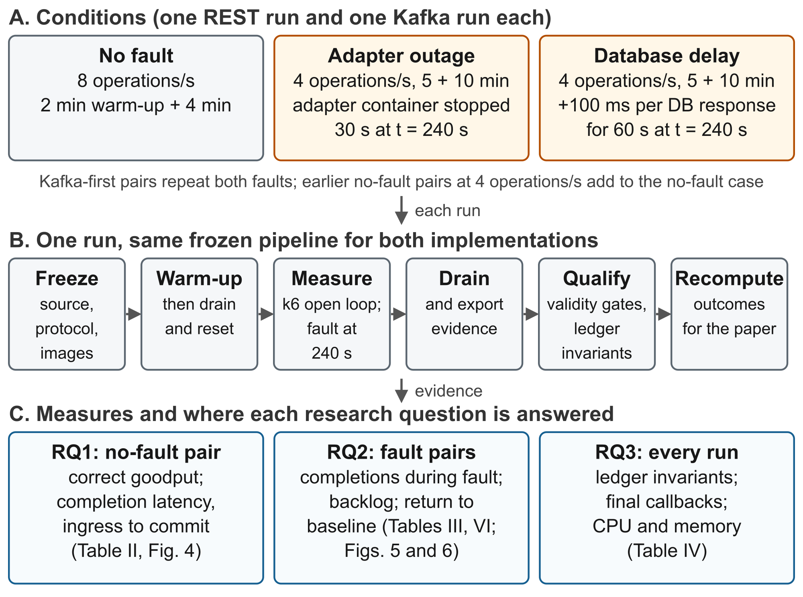
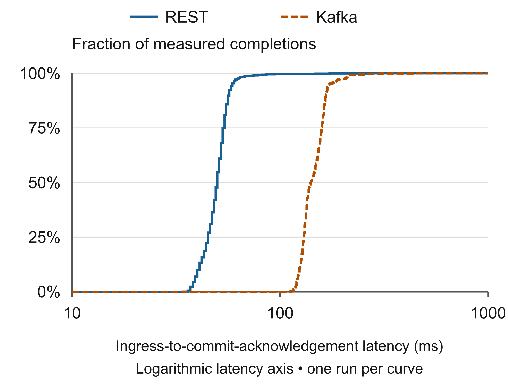
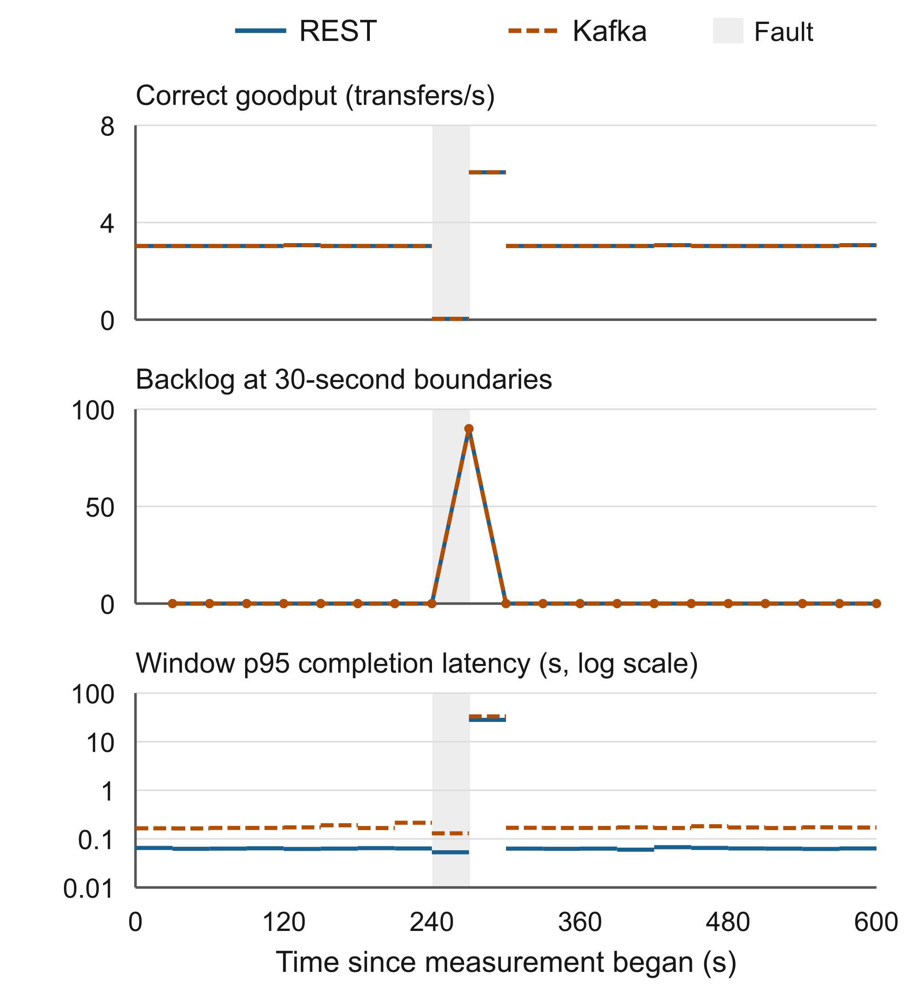
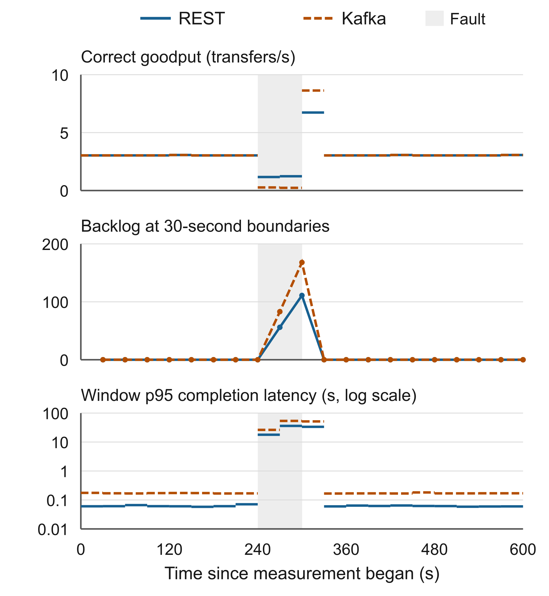

# REST Orchestration or Kafka Choreography Behind a Unified Telecom Mobile-Money P2P Transfer API: A Controlled Synthetic Benchmark

Shaban Lubanga

Department of Information Systems, Institut Teknologi Sepuluh Nopember, Surabaya, Indonesia

Abstract. We report an exploratory comparison of REST-style orchestration and Kafka-based choreography for synthetic transfers under a common asynchronous HTTP contract. Both implementations use co-located workflow logic, a shared PostgreSQL ledger design, and the same provider simulator; Kafka additionally uses a Redpanda broker and durable inbox/outbox processing. The reporting set comprises six runs: one REST–Kafka pair at 8 operations/s without faults and two pairs at 4 operations/s with an adapter outage or database-response delay; two further Kafka-first fault pairs and six archived no-fault runs are reported beside it. All 10,214 measured transfers in the reporting set, and all 7,296 in the fresh fault runs, completed correctly, with no observed ledger-invariant violations or drain-only completions. At 8 operations/s, observed p95 ingress-to-commit-acknowledgement latency was 59.0 ms for REST and 172.1 ms for Kafka. Three archived 4 operations/s no-fault pairs with identical application files, two of them executed Kafka first, showed the same direction and size of difference. Faults produced temporary backlogs and longer completion tails in both implementations; during the database-response delay REST kept completing at about 1.2 transfers/s per window while Kafka fell to about 0.25, consistent with Kafka issuing about 1.7 times as many database statements per run. Two fresh fault pairs collected afterwards with the Kafka condition executed first gave in-fault completions of 73 for REST and 13 for Kafka under database delay and 2 and 4 under the adapter outage, with pre-fault p95 of 61 ms and 169 ms. REST also had lower sampled service-set CPU and memory use. These are configuration-specific observations from one execution per architecture per condition and order, not capacity estimates or statistical evidence of general superiority. We provide explicit accounting boundaries and reproducible local analysis artifacts, and identify further run-level replication and configuration sensitivity as the main remaining uncertainties.

Index Terms. Synthetic benchmark, transfer coordination, Kafka, orchestration, choreography, durable completion.

## I INTRODUCTION

Mobile money lets people store and move value through an account tied to a mobile phone number, usually operated by a telecom provider. Because a sender and a recipient may use different providers, transfers between them depend on interoperability, which research on mobile payments identifies as a continuing economic and policy problem [13]; payment-policy bodies recommend harmonised application programming interfaces (APIs) because fragmented API standards raise processing time, cost, and error risk [14].

A person-to-person (P2P) transfer is one person sending money from their mobile wallet to another person's wallet, much like handing over cash, except that the two wallets may belong to different providers. Fig. 1 shows such a transfer as the user sees it. The sender chooses a recipient and an amount in a wallet at Provider A, the transfer application submits one request to a unified P2P transfer API, the platform routes the transfer to the recipient's provider and records it, and the recipient at Provider B receives the value. The sender then sees COMPLETED or FAILED; when processing takes longer, the application first shows PENDING and obtains the final result later through a callback or a status check. Behind that simple picture the platform must translate different provider interfaces, prevent duplicate transfers, keep balances correct, recover from failures, and reliably deliver the final result.

Fig. 1. User view of a P2P transfer through a unified mobile-money API. Adapted from the author's thesis proposal, based on the GSMA P2P use case [1]. The shaded step is what this paper measures; provider-side processing is simulated.

The GSMA Mobile Money API specification [15] defines the message language (party identifiers, amount, currency, transaction references, and status) and its asynchronous callback and polling flows; its P2P use case [1] frames the transfer in Fig. 1. Mojaloop [16] helps explain provider boundaries and a staged lookup, quote, and transfer workflow. Neither decides how the platform coordinates its own work. This paper varies one internal design choice while everything else stays fixed: REST orchestration, where a coordinator calls the workflow steps in sequence, versus Kafka choreography, where co-located handlers react to events carried through a broker and durable database records. Both implementations acknowledge the request first (HTTP 202) and deliver the result later. Because that early acknowledgement can arrive before the transfer is safely stored, we measure each transfer from the moment the API receives it to the moment the database confirms its final commit, and we count only transfers that completed, were not duplicated, and left the ledger balanced.

The prototype is deliberately bounded. Each transfer is routed through an adapter to one of two synthetic provider interfaces and recorded in one local ledger; it models the provider-facing side of such a platform, not settlement between two independently operated ledgers, and no real money or customer data is involved.

Our contribution is an auditable comparison that links generated operations to unique durable completions, ledger checks, and fault-response trajectories. The exploratory scope and the descriptive analysis were chosen after observing the results. We do not claim preregistration, a new coordination pattern, or a universal architecture ranking.

### Research questions

RQ1. At the tested no-fault load, what correct goodput and durable-completion latency were observed for each implementation?

RQ2. At a fixed 4 operations/s, how did an adapter outage and a database slowdown affect completions during the fault, the backlog, and the return to normal?

RQ3. Did every transfer end with a correct ledger record, and how much CPU and memory did each implementation use while doing so?

## II RELATED WORK

Kazanavičius and Mažeika compare HTTP REST, Kafka, RabbitMQ, gRPC, and GraphQL in communication experiments for monolith decomposition [2]. Their comparison motivates careful attention to the workload and deployment when interpreting transport results. Our endpoint instead requires a reconciled transfer and observed terminal database acknowledgement, and includes deliberately injected dependency faults.

Financial-style transfer benchmarks already exist. Son, Lee, and Lee describe a transfer-process model comparing two-phase commit, Saga choreography, Saga orchestration, and Axon [3]. The accessible author abstract supports this domain overlap; we do not infer its replication schedule or claim equivalent measurements without the full methods. Our contribution is therefore not the first use of transfers to compare coordination approaches.

Kristianto and Zahra vary service count, concurrent users, and instances in distributed Saga implementations [4]. Both of their coordination models use Kafka, unlike our direct-call versus event-driven packages. Their reported choreography advantage is tied to that deployment and does not contradict a different observation in our co-located implementation. We do not compare numerical latencies across these studies.

Nadeem and Malik report initial findings from porting a benchmark system to a workflow engine and identify fuller evaluation as future work [9]; we adopt the same early-results positioning. Hegde et al. compare synchronous and asynchronous microservice implementations using k6, Docker resource monitoring, and worker termination, and report API-response performance [10]. Our endpoint is durable ledger completion rather than API response, and both of our conditions expose an asynchronous client contract. Aydın and Çebi examine choreography and orchestration Saga implementations with isolated databases and cross-service rollback [11]; our common ledger is not that setting. The inbox/outbox mechanism in our Kafka condition follows the transactional outbox pattern described by Richardson [12].

Hasselbring argues that useful benchmarking requires explicit workloads, fairness, verifiability, and a replication package [5]. Kalibera and Jones emphasize repetition at the level where performance varies [6]. These considerations motivate our documented scope and our refusal to treat thousands of transfers within a run as thousands of independent architecture experiments.

## III SYSTEM UNDER TEST

Fig. 2. Deployment boundary. REST and Kafka are alternative application conditions; internal workflow stages are not independently deployed services.

### Common contract and provider simulation

POST /v1/transfers accepts payerId, payeeId, amount, currency, clientReference, a provider profile, and an optional callback URL. An idempotency key identifies the operation. New accepted work receives HTTP 202; replays refer to the original transfer. GET /v1/transfers/{id} returns its public state. Provider adapters translate the canonical fields and responses to two synthetic interfaces. No production provider data or real money is used.

Internal states progress through RECEIVED, VALIDATED, and PREPARED to FULFILLED or FAILED. The public states are PENDING, COMPLETED, and FAILED. Successful completion creates balanced local debit/credit postings. A durable synthetic-provider journal supports idempotent effects across adapter restarts. This is not a conformance test of any standard and not proof of atomic settlement across a provider and our ledger.

### Implementation packages

REST orchestration invokes local workflow functions in sequence and uses the common HTTP provider boundary. It does not make a REST network call between every internal stage. Kafka choreography subscribes co-located handlers to workflow events. PostgreSQL inbox/outbox records couple handler progress to event production and duplicate detection; a dispatcher polls every 50 ms and also dispatches on selected execution paths. KafkaJS communicates with one Redpanda broker using four partitions per workflow topic and replication factor one.

The business contract, provider delay, retry configuration, and four-worker limit are shared. Kafka-specific database writes, broker work, and dispatch scheduling are part of its measured implementation. Consequently, this comparison changes a package of coordination and durability mechanisms; it does not isolate the causal cost of the Kafka transport alone.

### Environment and controls

All runs used one Apple M2 host with eight logical CPUs and 16 GiB physical memory, running Linux containers through Docker. The application limit was two CPUs and 1 GiB memory. Software included Node.js 24 container images, pg 8.22.0, KafkaJS 2.2.4, PostgreSQL 17, Redpanda v26.1.14, Toxiproxy 2.12.0, and k6 1.8.0. Image IDs, resolved configuration, host metadata, and source archives were retained; tags alone are not the identity record.

The provider simulator used a 25 ms configured delay. Both conditions used eight provider retry attempts with 5 s spacing and a 90 s workflow timeout. The standard gateway profile applied 10 ms delay, 2.5 ms jitter, and 0.05% loss on each gateway egress. This profile was unchanged between conditions, although the primary latency clock begins after the request reaches the application. Monitoring remained enabled, and unrelated containers were paused during collection.

## IV EXPERIMENTAL METHOD

### Dataset and study history

The reporting set contains all six runs in the separately approved higher-load and fixed-load fault sequence, completed on 21 September 2026 under one frozen source and image identity (Section VII). Table I states the actual durations. Earlier engineering checks, calibration runs, interrupted attempts, and runs under previous harness revisions remain archived. Three archived no-fault pairs at 4 operations/s were collected under earlier experiment-harness revisions but identical application files; Section V reports them as separately labelled supplementary observations, not pooled with the reporting set. After the reporting set was analysed, two further fault pairs were collected on 2026-09-22 with the Kafka condition seeded to run first, under a rebuilt implementation whose application files differ from the reporting set only in the package name (source identity 713bbfc648f1…); Section V reports them beside the original pairs. The original capacity-search and provisional 96-run confirmatory plans were not completed.

TABLE I  COMPLETED EXPLORATORY DESIGN

| Condition | Rate
(operations/s) | Warm-up
(min) | Measure
(min) | Runs |
| --- | --- | --- | --- | --- |
| No fault | 8 | 2 | 4 | R + K |
| Adapter outage | 4 | 5 | 10 | R + K |
| Database delay | 4 | 5 | 10 | R + K |

Each row has one REST execution and one Kafka execution. The seeded order generator selected REST then Kafka in all three reporting-set pairs; the realized order was not balanced. Within the reporting set we therefore cannot separate an order or host-time effect from architecture. The two fresh fault pairs were executed Kafka first and provide the order-balanced counterpart for the fault scenarios; the supplementary archived pairs do so for the no-fault condition. No capacity boundary was established, and the fault rate was an absolute 4 operations/s, not 90% of estimated capacity.

Fig. 3. Experimental method. Every run follows the same frozen pipeline; the three conditions feed the three research questions through the tables and figures named.

### Deterministic workload

k6 uses the constant-arrival-rate executor to schedule operations independently of completion time while virtual users are available [7]. An operation is either a creation attempt or a status read, not necessarily a new transfer. The repeating 100-operation schedule contains 76 unique creations, four idempotent creation replays, and 20 status reads. Thus replays are 5% of creation attempts and 4% of all operations; these proportions are benchmark choices rather than estimates from customer traffic.

The iteration index generates amounts as 100 + (sourceIteration mod 900), encoded as positive integer minor-unit strings with currency UGX. A seed-derived offset rotates numbered synthetic payer/payee identities; iteration parity selects the provider profile. Replay slots reuse the preceding creation payload and key. Every status read targets the same setup transfer, which is excluded from the measured cohort; this is a deliberately simple read workload, not realistic polling.

The scheduled counts are 1,920 operations for a 4-minute run at 8/s and 2,400 for a 10-minute run at 4/s. Recorded streams contain one extra operation in some runs because an operation may fall on the ending boundary. A transfer belongs to the measured cohort if the server received it inside the measurement interval; setup transfers and boundary operations are retained in the accounting but excluded from the cohort.

### Procedure and fault injection

The controller prepares the selected condition, verifies configuration and isolation, runs warm-up, and waits for pending work to drain. It then resets trial data before starting the measured k6 phase. Fault timing uses the k6 scenario-start marker. After measurement it allows up to 10 minutes for drain, exports evidence, evaluates validity and outcomes, and cleans up; these steps are additional to the durations in Table I.

At measurement second 240, the adapter scenario stops the common adapter container, waits 30 s, and restarts it. The observed outage boundary runs from stop acknowledgement to health readiness, about 30.44 s. This is controlled adapter unavailability, not an abrupt application or broker crash. The database scenario adds 100 ms of downstream PostgreSQL-response delay through Toxiproxy for about 60.12 s. It does not slow disk hardware or isolate database-server execution time. Load continues at 4 operations/s throughout both faults and recovery.

### What is measured and how a run is accepted

For each unique transfer, latency is application API ingress to application-observed acknowledgement of the terminal database COMMIT, using one application wall clock. The clock starts before the request body is read and stops after COMMIT returns; the value is then persisted separately. It excludes client-to-API transit and is not the database’s exact internal commit instant. HTTP 202, an internal state timestamp, and callback delivery are not substitutes.

Correct goodput counts reconciled unique successes both admitted and confirmed during measurement, divided by measurement seconds. Latency quantiles describe those successful completions. We separately retain failures, pending transfers, missing timing, and completions during drain. Backlog is the number of measured arrivals still without a commit confirmation at each 30 s boundary; it is a sample, not the maximum queue size.

Recovery is the time from observed fault clearance to the end of three consecutive complete 30 s windows under continued load, each reaching at least 90% of baseline goodput and no more than 110% of baseline p95 latency. Baseline uses the last three full pre-fault windows. Backlog clearance is the first full post-clearance window ending at or below the baseline maximum backlog. Both are descriptive, and because a candidate window must begin after clearance, the rule adds a fixed reporting delay. We therefore also report the window-level trajectory: completions in windows whose boundary fell inside the fault interval, the first window after clearance, and whether the first complete window entirely after clearance already met the baseline criteria. That description was chosen after seeing the trajectories.

Validity checks cover configuration identity, workload delivery, correlation, instrumentation and service coverage, fault evidence, and cleanup. Correctness checks include unique idempotency keys, terminal-state history, one balanced ledger transaction per fulfilled transfer, posting/amount agreement, account-balance reconstruction, and conservation by currency. Final callback identity and status are checked separately. Valid performance failures and censored observations are retained rather than treated as invalid instrumentation.

### Descriptive analysis and resource scope

We recompute archived outcomes from traces, snapshots, and invariants and require exact agreement before generating tables. Quantiles use linear interpolation at (n − 1)p. With one pair per condition and order, we report no confidence interval, significance test, or equivalence conclusion, and conditions with different rates and durations are not pooled. For the supplementary archived pairs we verify qualification, invariant checks, and the p95 recomputation, and compare every application-defining file (application source outside the experiment harness, migrations, contracts, container definitions, k6 script, and dependency lock) in each frozen source archive against the reporting-set archive.

Resource summaries sum the application, gateway, PostgreSQL, Toxiproxy, adapter, callback receiver, Prometheus, and Grafana, plus Redpanda for Kafka. They exclude k6, the controller, and host overhead. Memory is Docker CLI usage, which subtracts cache on Linux [8]; CPU sums container percentages divided by 100. Means are time-weighted over samples about 2 s apart within measurement; a stopped adapter contributes zero while absent. These are descriptive footprints, not cost or reserved capacity.

## V RESULTS

Reading the measures. Completion latency is the time from the API receiving a request to the database confirming its final commit, in milliseconds (1,000 ms = 1 s). The median is the time within which half of the transfers completed; p95 is the time within which 95 of every 100 completed, and p99 the time within which 99 of every 100 completed, so p95 and p99 describe the slow tail. Correct goodput is the number of completed, non-duplicated, balanced transfers per second. Backlog is the number of accepted transfers not yet committed at a 30-second boundary. CPU is reported in core equivalents: 0.25 means a quarter of one processor core busy on average.

### Completion and correctness

All six runs were qualified. Across the reporting set, 10,214 unique measured transfers completed correctly. Each no-fault run completed 1,459 transfers, and each fault run completed 1,824. Every measured transfer had usable timing and a matching final callback. There were zero measured failures, zero pending transfers after drain, zero drain-only completions, and no observed invariant violations.

TABLE II  OBSERVED COMPLETIONS AND LATENCY

| Condition | Completed
transfers | Correct goodput
(transfers/s) | p95 latency
(ms) | p99 latency
(ms) |
| --- | --- | --- | --- | --- |
| No fault R | 1,459 | 6.079 | 59.0 | 74.4 |
| No fault K | 1,459 | 6.079 | 172.1 | 213.0 |
| Adapter R | 1,824 | 3.040 | 2,479.4 | 25,135.3 |
| Adapter K | 1,824 | 3.040 | 6,708.8 | 30,576.5 |
| Database R | 1,824 | 3.040 | 19,237.2 | 33,206.2 |
| Database K | 1,824 | 3.040 | 28,776.8 | 50,408.5 |

R denotes REST and K denotes Kafka. Completed transfers exclude replays and status reads. Latency is the time from API ingress to the confirmed final commit; p95 means 95 of every 100 transfers completed within that time, so 2,479.4 ms is about 2.5 s. Equal correct goodput follows from every implementation completing the whole offered cohort; it does not indicate equal capacity.

### No-fault observation

At 8 operations/s, both implementations achieved 6.079 correct transfers/s and had zero backlog at all eight 30 s boundaries. Median completion latency was 50 ms for REST and 141 ms for Kafka. The p95 (95 of every 100 transfers) was 59.0 ms for REST and 172.1 ms for Kafka, an observed difference of 113.1 ms. Fig. 4 shows the within-run distributions. A four-minute screen at one rate does not demonstrate long-run sustainability or maximum capacity.

Fig. 4. Empirical completion-latency distributions at 8 operations/s without faults. Each curve is one run with 1,459 measured completions, not a distribution of independent run estimates.

### Fault response

The adapter outage produced a sampled backlog maximum of 90 in each implementation (Fig. 5). Over the whole measurement, 95 of every 100 transfers completed within 2.48 s for REST and 6.71 s for Kafka; the p99 reached 25.14 and 30.58 s. Both eventually completed every measured transfer before measurement ended. Whole-run goodput of 3.04/s masks the temporary interruption visible in the trajectory. In the one window whose boundary fell inside the outage, each implementation completed 1 transfer; in the following window each completed the backlog at 6.07 transfers/s. At this resolution the two adapter-outage trajectories are indistinguishable except for the latency offset already present before the fault.

Fig. 5. Adapter-outage response at 4 operations/s. Shading spans the observed fault intervals. Horizontal segments show statistics for complete 30 s windows; backlog markers show boundary samples. Lines between backlog samples are visual guides.

Under database-response delay, sampled backlog reached 111 for REST and 168 for Kafka (Fig. 6). Measurement-wide p95 was 19.24 versus 28.78 s. Both resumed sufficient completion activity to clear all measured work before the end. The two implementations behaved differently while the delay was active: in the two windows whose boundaries fell inside it, REST completed 72 transfers (about 1.20/s per window) while Kafka completed 15 (about 0.25/s). The catch-up window then reached 6.73/s for REST and 8.63/s for Kafka. The longest single completion was 36.7 s for REST and 56.5 s for Kafka against the 90 s workflow timeout, so a longer delay of this kind would have produced timeouts in Kafka first. These observations do not estimate an isolated fault effect relative to the 8/s screen because load and duration differ; the within-run pre-fault baseline and the supplementary 4/s pairs provide the local reference.

Fig. 6. Database-delay response at 4 operations/s, with the same display conventions as Fig. 5. The injected delay affects downstream database responses for about 60 s.

### Fresh Kafka-first fault pairs

Two fresh pairs repeated the adapter-outage and database-delay scenarios at 4 operations/s with identical settings, durations and workload seeds, but with the Kafka condition executed first. All four runs qualified with zero failures, zero pending transfers, and no invariant violations; every measured transfer had a matching final callback. Table VI places each fresh pair beside the original REST-first pair. Pre-fault baseline p95 was 75 ms and 61 ms for REST and 173 ms and 169 ms for Kafka, in the range of every earlier 4 operations/s observation.

Under the adapter outage the fresh pair completed 2 (REST) and 4 (Kafka) transfers in the window ending inside the outage, against 1 and 1 originally; sampled backlog peaked at 89 and 87. Under database delay the fresh pair completed 73 (REST) and 13 (Kafka) transfers in the two windows ending inside the delay, against 72 and 15 originally, with peak backlog 110 and 170 and longest completions of 36.6 s and 57.3 s. With one pair per order, these are two observations per scenario, not an estimate of order effect; they let the direction seen in the original pairs be checked against a pair in which Kafka did not run second.

TABLE VI  ORIGINAL AND FRESH 4 OPS/S FAULT PAIRS BY REALIZED ORDER

| Fault / pair | Order | Arch. | n | Peak
backlog | Done in
fault | p95
(s) | Normal
1st win. |
| --- | --- | --- | --- | --- | --- | --- | --- |
| Adapter orig. | 1st | R | 1,824 | 90 | 1 | 2.48 | yes |
| Adapter orig. | 2nd | K | 1,824 | 90 | 1 | 6.71 | yes |
| Adapter fresh | 1st | K | 1,824 | 87 | 4 | 6.50 | yes |
| Adapter fresh | 2nd | R | 1,824 | 89 | 2 | 1.85 | yes |
| Database orig. | 1st | R | 1,824 | 111 | 72 | 19.24 | yes |
| Database orig. | 2nd | K | 1,824 | 168 | 15 | 28.78 | yes |
| Database fresh | 1st | K | 1,824 | 170 | 13 | 30.48 | yes |
| Database fresh | 2nd | R | 1,824 | 110 | 73 | 19.28 | yes |

Original pairs ran REST first on 21 September 2026 under the reporting-set identity; fresh pairs ran Kafka first on 2026-09-22 under the rebuilt identity (Section VII). Columns are defined as in Table III. Measurement-wide p95 mixes pre-fault, in-fault and catch-up completions and is shown for comparability with Table II only.

TABLE III  DESCRIPTIVE FAULT TRAJECTORY

| Fault / condition | Peak
backlog | Completed
during fault | Longest
transfer (s) | Normal in first
window after |
| --- | --- | --- | --- | --- |
| Adapter R | 90 | 1 | 35.2 | yes |
| Adapter K | 90 | 1 | 36.4 | yes |
| Database R | 111 | 72 | 36.7 | yes |
| Database K | 168 | 15 | 56.5 | yes |

Completed during fault counts transfers completed in the 30 s windows whose boundary fell inside the observed fault interval: one window for the adapter outage and two for the database delay. Longest transfer is the single slowest completion in the run. The last column states whether the first complete window entirely after fault clearance already met the predefined 90% goodput and 110% p95 baseline criteria. Under the predefined rule, every run scored about 59–60 s to backlog clearance and 119–120 s to recovery; no result was censored. Those scores are retained in the analysis package, but they reflect the window definition and its alignment, not a measured difference between implementations: in every run the systems had returned to baseline in the first eligible window and the rule's three-window confirmation set the recorded time.

### Resources and diagnostic context

TABLE IV  TIME-WEIGHTED SERVICE RESOURCES

| Condition | CPU
(core eq.) | Memory
(MiB) | App CPU
(core eq.) |
| --- | --- | --- | --- |
| No fault R | 0.226 | 364.5 | 0.069 |
| No fault K | 0.330 | 656.5 | 0.113 |
| Adapter R | 0.167 | 360.8 | 0.046 |
| Adapter K | 0.257 | 636.7 | 0.087 |
| Database R | 0.168 | 367.7 | 0.048 |
| Database K | 0.263 | 640.4 | 0.090 |

In the no-fault pair, sampled service CPU was 0.226 core equivalents for REST and 0.330 for Kafka; memory was 364.5 and 656.5 MiB. The Kafka broker alone averaged 271.7 MiB. Application-only CPU was also higher for Kafka in this pair. The same direction appears in both fault pairs, but resource use has no independent run-level uncertainty estimate. Sampling covered all but the first and last one to two seconds of each measurement.

Diagnostic aggregates around the no-fault measurement show provider execution averaging about 30.1 ms for REST and 29.0 ms for Kafka. These aggregates include setup/boundary operations and are not exact measured-cohort estimates. Their similarity is consistent with a common provider setting, but it does not explain the remaining latency difference. Database calls, event dispatch, broker delivery, and scheduling overlap or nest; adding their quantiles would not produce a valid decomposition.

Statement counts are additive and can be compared. In the no-fault screen the Kafka application issued 107,327 database statements against 63,219 for REST, including 31,730 pool-level statements, mostly inbox/outbox polling and dispatch bookkeeping, against 3,698. The fault runs show the same ratio. An added 100 ms per database round trip therefore multiplies through roughly 1.7 times as many statements per run in Kafka, which is consistent with its larger in-fault stall under database delay, although it is an association, not a causal decomposition.

### Supplementary archived no-fault pairs

Before the reporting set, three REST–Kafka pairs were collected at 4 operations/s without faults under earlier experiment-harness revisions. Their frozen source archives differ from the reporting-set archive only in harness, protocol, and documentation files; the application-defining files are identical apart from a strict-versus-inclusive inequality in the calibration k6 check threshold, which does not affect traffic. All three pairs qualified with zero failures, zero pending transfers, and zero backlog at every 30 s boundary. Table V lists them with their realized order; they were not selected by outcome.

TABLE V  ARCHIVED 4 OPS/S NO-FAULT PAIRS, SAME APPLICATION FILES

| Pair | Order | Warm/
meas. | Arch. | n | Median
(ms) | p95
(ms) | p99
(ms) |
| --- | --- | --- | --- | --- | --- | --- | --- |
| Calib. 1 | 1st | 5/10 | R | 1,824 | 53.0 | 61.0 | 63.8 |
| Calib. 1 | 2nd | 5/10 | K | 1,824 | 146.0 | 170.0 | 180.5 |
| Calib. 2 | 1st | 5/10 | K | 1,824 | 146.0 | 170.0 | 210.1 |
| Calib. 2 | 2nd | 5/10 | R | 1,824 | 54.0 | 61.0 | 70.0 |
| Screen. | 1st | 2/4 | K | 729 | 146.0 | 170.0 | 220.9 |
| Screen. | 2nd | 2/4 | R | 729 | 54.0 | 62.0 | 70.7 |

Across these pairs REST p95 was 61–62 ms and Kafka p95 was 170 ms, with two of the three pairs executed Kafka first. The direction and size of the no-fault difference therefore repeated under both realized orders and at two run lengths, and the 8 operations/s screen fell in the same range. One further archived pair under an earlier application revision showed the same direction and is not tabulated. These are not a designed replication: harness revisions, dates, and protocols differ, and no confidence interval is derived from them.

## VI DISCUSSION AND LIMITATIONS

The strongest supported statement is that REST had lower observed completion latency and sampled resource use in every pair, while both implementations preserved the tested ledger invariants and completed all admitted work. Neither demonstrated a capacity advantage. The archived pairs show the no-fault difference repeating under both orders and two run lengths; the fresh pairs do the same for the faults: under database delay, completions during the fault were higher for REST (73) than for Kafka (13) in the fresh pair, compared with higher for REST (72) than for Kafka (15) in the original pair. Two pairs per scenario are still not a replication estimate.

The comparison bundles direct-call coordination with one durability path and event-driven coordination with another. Kafka adds inbox/outbox writes, broker communication, and dispatch scheduling. The 50 ms polling setting is a plausible contributor to its latency: a transfer crosses several event hops, and the observed median gap of about 90 ms is of the order of a few hops each waiting on average half of the polling interval, but these data cannot identify how much delay it caused. The statement-count ratio offers a separate, additive explanation for the database-delay result. A polling-interval sensitivity experiment would be needed before any causal claim. Co-located handlers and the shared ledger also remove distributed-service behaviours that may favor other designs.

Internal validity is limited by one execution per architecture per scenario and order, a rebuilt implementation identity for the fresh pairs (application files identical apart from the package name), and a shared laptop/virtual-machine environment. Isolation checks remove competing containers but do not eliminate host scheduling, thermal, storage, or clock effects. Diagnostic collection adds overhead. The post-commit observation can be lost in a narrow crash interval; a ledger success without that observation must not be assigned a reconstructed latency.

External validity is limited by deterministic arrivals, synthetic provider responses, one status-read target, limited account/amount patterns, and a single broker with replication factor one. The workload does not represent an empirically sampled operator trace. The adapter test does not cover application termination, broker loss, host failure, network partitions, or real provider-side economic reconciliation. No claim of general crash safety or production mobile-money performance follows.

The publication scope was selected after the observations, and we preserve that history rather than relabel the data as a preregistered confirmatory study. The unequal no-fault and fault rates and durations prevent a controlled cross-scenario contrast. Further run-level repetition of every condition under both orders is the next priority; workload and polling sensitivities address different questions and should remain separate. The window-based recovery rule should also be revised before any confirmatory study, since it produced identical scores for visibly different trajectories.

## VII ETHICS AND REPRODUCIBILITY

All account identifiers, amounts, and provider responses are synthetic; no customer dataset or real funds are used. Local artifacts retain the evidence for all sixteen runs reported here (six reporting-set, four fresh, six archived), exact protocol/source/image identities, client attempts, transfer snapshots, traces, ledger checks, fault timings, and cleanup records. The analysis recomputes outcomes and verifies file inventories before and after reading. Tables and figures are generated from the resulting JSON rather than manually transcribed. The reporting-set source identity is 7995e552…, the fresh-pair identity is 713bbfc6…; full hashes, pinned image identities, and review receipts are in the results package.

The accompanying local results package documents the evidence roots, software dependencies, analysis commands, resource scope, and unexecuted follow-up proposal. The original pre-results manuscript and frozen run evidence remain unchanged. A public archival identifier, redistribution licence, and independent reproduction have not yet been established; we therefore claim local reproducibility support, not a publicly verified artifact.

## VIII CONCLUSION

This exploratory benchmark links synthetic transfer traffic to durable completion and ledger correctness under one common asynchronous client contract. In sixteen executions (six reporting-set, six archived same-application, four fresh Kafka-first), every measured transfer completed correctly. REST had lower observed completion tails and sampled resource use in every pair, under both realized orders; both implementations accumulated and later cleared fault-induced backlogs. While database responses were delayed, in-fault completions were higher for REST (72) than for Kafka (15) in the original pair and higher for REST (73) than for Kafka (13) in the fresh Kafka-first pair, consistent in both pairs with Kafka's larger statement count. The results support a bounded comparison of these implementations and identify questions for further testing. They do not establish capacity, general architecture superiority, or equivalent recovery time. Further repetitions under both orders and focused configuration sensitivity would strengthen those inferences.

## REFERENCES

[1] GSMA, “P2P Transfers,” Mobile Money API Developer Portal. Accessed Sep. 21, 2026. https://developer.mobilemoneyapi.io/use-cases/p-2-p-transfers/

[2] J. Kazanavičius and D. Mažeika, “The Evaluation of Microservice Communication While Decomposing Monoliths,” Computing and Informatics, vol. 42, no. 1, pp. 1–36, 2023. doi: 10.31577/cai_2023_1_1.

[3] S.-B. Son, C. Lee, and K. Lee, “Comparison of Distributed Transactions in Microservice Architecture,” The Journal of Information Technology and Architecture, vol. 20, no. 4, pp. 281–294, 2023. doi: 10.22865/jita.2023.20.4.281.

[4] H. Kristianto and A. Zahra, “Performance Analysis of Choreography and Orchestration in Microservices Architecture,” Journal of Theoretical and Applied Information Technology, vol. 99, no. 18, pp. 4220–4230, 2021. https://www.jatit.org/volumes/Vol99No18/4Vol99No18.pdf

[5] W. Hasselbring, “Benchmarking as Empirical Standard in Software Engineering Research,” in Proc. Evaluation and Assessment in Software Engineering (EASE), pp. 365–372, 2021. doi: 10.1145/3463274.3463361.

[6] T. Kalibera and R. Jones, “Rigorous Benchmarking in Reasonable Time,” in Proc. International Symposium on Memory Management (ISMM), pp. 63–74, 2013. doi: 10.1145/2464157.2464160.

[7] Grafana Labs, “Constant arrival rate,” k6 documentation. Accessed Sep. 21, 2026. https://grafana.com/docs/k6/latest/using-k6/scenarios/executors/constant-arrival-rate/

[8] Docker, “docker container stats,” Docker documentation. Accessed Sep. 21, 2026. https://docs.docker.com/reference/cli/docker/container/stats/

[9] A. Nadeem and M. Z. Malik, “A Case for Microservices Orchestration Using Workflow Engines,” in Proc. IEEE/ACM 44th Int. Conf. Software Engineering: New Ideas and Emerging Results (ICSE-NIER), pp. 6–10, 2022. doi: 10.1145/3510455.3512777.

[10] P. Hegde N et al., “An Empirical Evaluation of Synchronous vs Asynchronous Microservice Architectures for Enterprise Messaging Platforms,” in Proc. Int. Conf. Artificial Intelligence and Data Engineering (AIDE), pp. 663–666, 2026. doi: 10.1109/AIDE69088.2026.11545016.

[11] S. Aydın and C. B. Çebi, “Comparison of Choreography vs Orchestration Based Saga Patterns in Microservices,” in Proc. Int. Conf. Electrical, Computer and Energy Technologies (ICECET), pp. 1–6, 2022. doi: 10.1109/ICECET55527.2022.9872665.

[12] C. Richardson, Microservices Patterns: With Examples in Java. Shelter Island, NY, USA: Manning, 2018.

[13] M. Bianchi, M. Bouvard, R. Gomes, A. Rhodes, and V. Shreeti, “Mobile payments and interoperability: Insights from the academic literature,” Information Economics and Policy, vol. 65, art. 101068, 2023. doi: 10.1016/j.infoecopol.2023.101068.

[14] Committee on Payments and Market Infrastructures, “Promoting the harmonisation of application programming interfaces to enhance cross-border payments: Recommendations and toolkit,” Bank for International Settlements, Basel, 2024. https://www.bis.org/cpmi/publ/d224.htm

[15] GSMA, “Mobile Money API Specification 1.2.0: Fundamentals,” GSMA, London, 2021. https://www.gsma.com/mobilefordevelopment/wp-content/uploads/2021/10/Mobile-Money-API-Specification-1.2.0-Fundamentals.pdf

[16] Mojaloop Foundation, “Mojaloop Hub,” Mojaloop documentation, 2022. https://docs.mojaloop.io/technical/overview/
