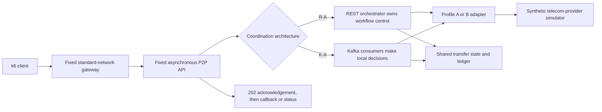

# Architecture and experimental boundary

## One fixed contract and one variable

The public API remains REST in both conditions. REST versus Kafka describes internal workflow coordination only. Client-result delivery is asynchronous and identical in R-A and K-A.

## REST orchestration

`RestOrchestrator` owns the complete workflow. It validates the current state, records command intent, calls the next internal operation, evaluates the response, and advances or terminates the transfer. Recovery reads the durable state and retries unfinished work under the shared retry policy.

## Kafka choreography

Co-located handlers react to `transfer.received`, `transfer.validated`, `transfer.prepared`, `provider.completed`, and `provider.failed`. They share one Node application process and database. Redpanda provides the Kafka-compatible broker. PostgreSQL transactions atomically commit a handler's state change, outgoing event, and inbox acknowledgement. A failed transaction leaves the input retryable. Provider calls occur outside database transactions; durable provider commands and the simulator's journal reconcile response loss. These handlers are not independently deployed microservices.

## Provider adapters

The experiment uses two synthetic telecom-provider interfaces so one public request can be translated without making provider choice another experimental factor.

- Profile A accepts `sender`, `recipient`, `value`, `currency`, `requestKey`, and `clientReference`; it returns `PROCESSING`, `SUCCESS`, or `DECLINED`.
- Profile B accepts `debitParty`, `creditParty`, a nested `amount`, `requestKey`, and `transferReference`; it returns `PENDING`, `COMPLETED`, or `REJECTED`.

Both mappings produce the same public `PENDING`, `COMPLETED`, or `FAILED` meaning. Provider order is prespecified and identical across R-A and K-A. Both mappings run in the same `adapter-service` container, so stopping that container creates one common adapter-boundary fault.

## Durable completion

Docker research conditions use PostgreSQL. A successful transfer locks the required rows and atomically commits account changes, ledger transaction, two postings, and `FULFILLED` state. Kafka additionally commits its outgoing event and inbox acknowledgement in that transaction. A separate `COMMIT_CONFIRMED` observation records when the application receives the commit acknowledgement. A crash between commit and that observation creates a timing gap; recovered state is never assigned a fabricated original commit time.

Both designs use the same provider retry burst, retry deadline, and durable request key. A definite decline or known unavailability can fail the transfer. A network timeout is an unknown provider outcome and remains pending for reconciliation. The deadline bounds retry bursts; it does not reverse an in-flight or potentially accepted provider effect. A startup and periodic recovery scan resumes pending REST states and retries undelivered terminal callbacks. Kafka progress resumes from its outbox and broker offsets, and uses local terminal notifications rather than per-transfer database polling.

Application concurrency is bounded at four REST workflows or four Kafka provider handlers, with four Kafka partitions per topic and four concurrently consumed partitions. Each application has a default two-CPU, 1 GiB container budget. Kafka's broker overhead remains part of the system cost. This equal provider-concurrency ceiling does not imply identical scheduling or identical database write counts.

The simulator journal stores one response per provider request key and rejects changed payloads. It survives adapter container restarts on a dedicated volume. It is a synthetic effect registry, not a separate provider wallet ledger or real settlement system.

## Correctness rules

1. One idempotency key cannot create two durable transfers.
2. Reusing a key with a different payload is rejected.
3. A terminal state cannot be reversed.
4. Every completed transfer has exactly one matching ledger transaction.
5. A failed transfer has no ledger transaction.
6. Total synthetic value is conserved.
7. Callback or status evidence makes the final result observable outside the internal workflow.

## Whole-system measurement boundary

Resource sampling includes every container in the active Compose project. K-A therefore includes Redpanda and its storage cost. Application-only resource use may be reported as a sensitivity view, but it is not the primary comparison.

The study does not deploy a national switch, settlement system, real mobile-money provider, or production customer data. It does not compare synchronous and asynchronous client delivery.
