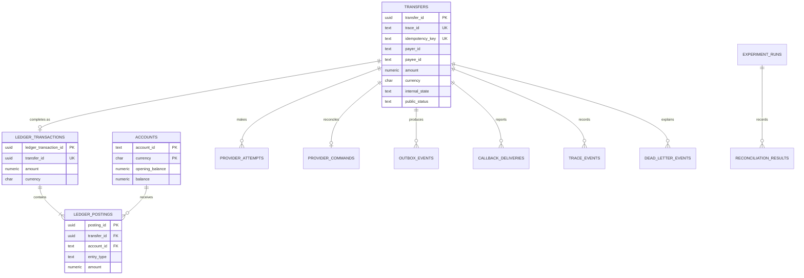

# PostgreSQL data model

PostgreSQL 17 is the durable database used by the Docker research conditions. The schema is defined by the ordered files in [`migrations/`](../migrations/), including `005_provider_commands.sql`. Application startup applies unapplied migrations and records them in `schema_migrations`.



## Operational tables

| Table | Stored evidence |
|---|---|
| `transfers` | Public request, idempotency fingerprint, internal/public state, provider result and history |
| `accounts` | Opening and current synthetic wallet balances by currency |
| `ledger_transactions` | One durable accounting transaction per completed transfer |
| `ledger_postings` | Exactly one debit and one credit per ledger transaction |
| `provider_attempts` | Provider profile, mapped request, response, outcome and timing |
| `provider_commands` | Durable provider request key and normalized result reused during recovery |
| `callback_deliveries` | Callback payload, attempt, HTTP outcome and error |
| `outbox_events` | Events committed with workflow changes before broker publication |
| `inbox_events` | Consumed event IDs used to suppress duplicate Kafka delivery |
| `trace_events` | Cross-boundary events keyed by transfer and trace ID |
| `dead_letter_events` | Exhausted or non-recoverable provider-boundary failures |

## Experiment tables

| Table | Stored evidence |
|---|---|
| `experiment_runs` | Condition, load, network, fault, seed, manifest and qualification status |
| `reconciliation_results` | Run-level invariant and value-conservation results |
| `schema_migrations` | Applied database migration versions |

## Atomic completion

PostgreSQL locks the transfer and both account rows, checks funds, changes both balances, inserts the ledger transaction and its debit/credit postings, and updates the transfer to `FULFILLED` in one database transaction. Kafka also commits the final outbox event and consumed inbox event in that same transaction. If a statement fails before commit, the whole transaction rolls back. A separate post-commit trace records the application-observed acknowledgement; failure to persist that observation is missing timing evidence, not a rollback of the committed ledger.

## Inspect the database

Start one condition, for example R-A:

```bash
docker compose --profile rest-async up -d --build
```

Then use the API endpoints:

```bash
curl http://localhost:8082/admin/storage
curl http://localhost:8082/admin/accounts
curl http://localhost:8082/admin/provider-attempts
curl http://localhost:8082/admin/outbox
curl http://localhost:8082/admin/traces
curl http://localhost:8082/admin/dead-letters
curl http://localhost:8082/admin/telemetry
```

Or connect directly:

```bash
docker compose exec postgres psql -U experiment -d experiment
```

Useful SQL:

```sql
\dt
SELECT * FROM transfers;
SELECT * FROM accounts;
SELECT * FROM ledger_transactions;
SELECT * FROM ledger_postings;
SELECT * FROM provider_attempts;
SELECT * FROM outbox_events ORDER BY created_at;
SELECT * FROM inbox_events ORDER BY consumed_at;
SELECT * FROM trace_events ORDER BY trace_event_id;
SELECT * FROM dead_letter_events ORDER BY dead_letter_id;
```

`docker compose down` stops containers but preserves the named PostgreSQL volume. `POST /admin/reset` clears research data without removing the schema. Use `docker compose down -v` only when you intentionally want to delete the database volume.
