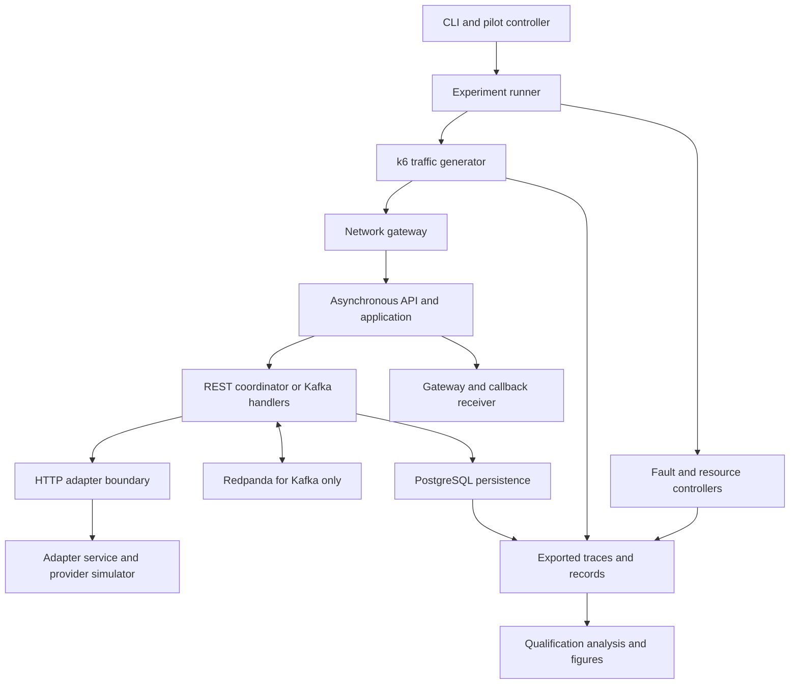
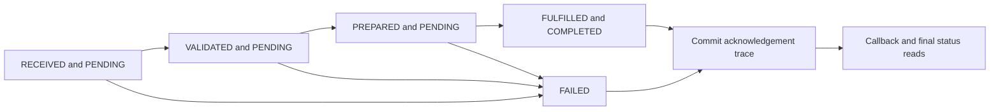
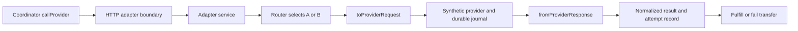
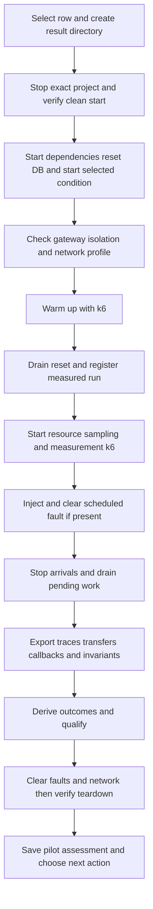

# Mobile Money Coordination Experiment Technical Guide

Onboarding and operational reference • 21 September 2026 • Repository version 0.2.0

This guide explains how a command becomes synthetic traffic, how that traffic becomes durable transfer records, and how the records become research evidence. It is for junior developers, testers, researchers and technical stakeholders. Start with sections 1–5; use the later sections when you need to operate or change a particular component.

The executable implementation is the authority. Source references below are repository-relative and refer to the inspected snapshot. Commands run from the repository root unless stated otherwise. Angle-bracket arguments are placeholders to replace, not literal shell input. No credentials are reproduced. Documentation does not authorize a new experiment or removal of a launch guard.

## 1 Executive summary and current scope

In simple terms: this is a small laboratory for comparing two ways of coordinating the same simulated mobile-money transfer. It does not connect to a real mobile-money network or move real money. A successful transfer moves synthetic value between accounts in a ledger.

The independent factor is coordination architecture: REST orchestration, labelled R-A, or Kafka choreography, labelled K-A. Both measured conditions have an asynchronous client API: the client receives an acknowledgement before the workflow necessarily finishes. Both share request validation, provider profiles, ledger rules, PostgreSQL, adapter service, gateway and callback receiver. Kafka additionally uses Redpanda, a Kafka-compatible message broker. They run sequentially, not as competing simultaneous benchmark stacks.

The REST label does not mean that every internal workflow stage is an HTTP microservice. Its coordinator calls JavaScript functions in one process. Kafka has topic-driven handlers in that application process. These deployment choices constrain what the experiment can claim about architecture in general. Evidence: `src/system.js:createSystem`, `src/coordination/rest-orchestrator.js:execute`, `src/coordination/kafka-choreography.js:registerHandlers`, `compose.yaml`.

### What has actually been completed

| Evidence root | Pair and timing | What it supports |
| --- | --- | --- |
| results-queue-screening-r8-v2 | R-A and K-A; 8 operations/s; 2m warm-up and 4m measurement; no fault | Descriptive comparison at this tested rate |
| results-exploratory-adapter-r4-v1 | R-A and K-A; 4 operations/s; 5m and 10m; adapter outage | Exploratory failure and recovery observations |
| results-exploratory-database-r4-v1 | R-A and K-A; 4 operations/s; 5m and 10m; database-response delay | Exploratory delay and recovery observations |

These six runs are the current paper selection, not the entire historical run archive. There is one execution per architecture per scenario. Older pilots, calibrations and failed attempts remain intact but are not interchangeable replications. The six-run analysis records 10,214 measured completed transfers. The number of transfers is not the number of independent experimental repetitions. Evidence: `scripts/analyze-exploratory-paper.mjs:selections` and `analyze`; `.research/exploratory-paper-v1/analysis.json`; the three roots' `pilot-state.json`.

Capacity has not been established. The draft queue-growth-v1 capacity rule remains blocked after validation found problematic bounded-queue patterns. Approved queue-observation-v2 protocols describe sampled queue behavior, without automatically declaring a capacity pass or overload boundary. The older latency-jitter rule remains in legacy code/configuration; do not silently apply it to the newer exploratory evidence. The 96-run matrix is a separate, unlaunched confirmatory candidate. Evidence: `src/experiment/capacity-queue.js:6–18`, `src/experiment/queue-observation.js`, `config/pilot-protocol.json`, `scripts/generate-run-matrix.mjs`.

### What is not implemented

Not found / requires confirmation: a component or API called WC; file uploads, file-download workflows, SFTP or object-store transfer adapters; cold-storage archival/retrieval experiments; real mobile-money provider credentials/integration; a production deployment pipeline; a repository CI workflow. In earlier questions, “wc” may have meant “which,” but that is an interpretation, not a discovered subsystem. The implemented transfer is a money-domain JSON operation, not a file transfer. Local JSON, JSONL and archive files store research evidence; they are not a cold-storage service.

## 2 If You Are New to This Codebase

### Level 1 What is this system

A client asks to move synthetic value from a payer to a payee. The system remembers the request, asks a pretend provider to process it, records the final outcome, and sends a callback. A callback is an HTTP message from the server to the client's nominated receiver. This lets the original request return promptly while processing continues.

### Level 2 What happens when I run a test

There are three different meanings of test. `npm test` runs automated code checks. A manual k6 test generates traffic against a server you already started. A controller-managed experiment starts dependencies, warms the system, resets measurement state, runs k6, optionally injects a fault, drains unfinished work, exports records, checks correctness and tears down services. Only the last path creates the complete research evidence bundle.

### Level 3 What are the major components

The pilot controller chooses work. The experiment runner operates one run. k6 is the traffic generator. The API accepts requests. A coordinator advances transfers. An adapter translates field names and statuses. The synthetic provider returns an outcome. Persistence stores transfers, ledger entries and evidence. Analysis joins timestamps and checks to produce metrics. Docker runs their processes in containers; it is not the source of payload data.

### Level 4 How does the code work

Read `src/server.js`, then `src/system.js`, `PaymentApplication.submit`, your chosen coordinator's `execute`, `callProvider`, the profile adapter, and `PostgresPersistence.fulfill`. Then read `infra/k6/load.js` to see the caller. Imports load definitions; `createSystem` constructs instances; methods do not execute merely because they are exported. The pilot is outside this application process and launches it through Compose.

### Level 5 How do I debug it

Find the run ID first, then its controller status and manifest. Identify one failed or slow transfer ID and its idempotency key. Follow its client attempt, API receipt, state transitions, provider attempts, commit confirmation and callback. Compare these with resource and database diagnostics at the same time. Do not equate a high HTTP response time with a slow ledger commit without checking which timestamp is being measured.

### Level 6 How do I safely modify it

Use the smallest relevant module and its tests. Run the offline checks before integration tests. Work on a new reviewed evidence series for behavior changes; never edit frozen source during a pilot or overwrite an archived run. Section 16 maps changes to tests. Documentation changes here do not change experiment behavior or retroactively change the rules of earlier runs.

## 3 Five Minute Quick Start

Five minutes describes the shortest learning path once prerequisites are installed. Downloads, container builds and scientific experiments can take longer. Do not promise a full pilot in five minutes.

### Local development without Docker

Install Node.js 24 or newer and npm. From the project directory:

```bash
npm ci
npm test
npm run smoke
npm run start:rest
```

`npm ci` installs the lockfile dependencies. The application has only two external runtime packages: `pg` and `kafkajs`. Node supplies HTTP, filesystem access, crypto, processes and the test runner. No Express, ORM or dotenv is required. `npm run smoke` constructs both coordinators with in-memory dependencies, submits a transfer, waits for completion and checks invariants. It does not contact a running API or real Kafka broker.

In a second terminal:

```bash
curl -s http://localhost:8080/health
curl -s -X POST http://localhost:8080/v1/transfers \
  -H 'Content-Type: application/json' \
  -H 'Idempotency-Key: guide-transfer-001' \
  -d '{"payerId":"payer-demo","payeeId":"payee-demo","amount":"100","currency":"UGX","clientReference":"DEMO-001","providerProfile":"A"}'
```

Copy the returned transferId, then replace the placeholder:

```bash
curl -s http://localhost:8080/v1/transfers/<transferId>
curl -s http://localhost:8080/admin/invariants
```

Expected behavior: the create call returns 202 for a new asynchronous request; status eventually becomes COMPLETED for this non-decline example; invariants report `passed: true`. Repeating exactly the same payload and key retrieves the same transfer. Changing its payload while reusing the key returns 409. Ctrl-C stops the development server; memory state disappears with the process. Never use this endpoint set on an exposed production host.

### Your first load command

With that server still running, and host k6 installed:

```bash
k6 run -e BASE_URL=http://localhost:8080 \
  -e OFFERED_RATE=4 -e DURATION=1m \
  -e RUN_ID=guide-load-001 -e RANDOM_SEED=demo infra/k6/load.js
```

k6 reads `infra/k6/load.js`; this is not executable with `node`. A unique RUN_ID separates this attempt from older manual requests. This example uses memory storage, not the measured PostgreSQL stack. It neither injects faults nor produces all qualification artifacts. Its console checks are useful for learning, not sufficient for paper results.

### Inspect a representative pilot without launching it

```bash
npm run pilot:status -- results-exploratory-database-r4-v1
npm run experiment -- --block LOAD --limit 2
```

The first command reports a completed archived pair. The second previews two candidate rows without running them. A new pilot must follow section 12, including scope review and preparation. Current completed exploratory roots must not be relaunched. Dependencies, full execution, reports and cleanup are deliberately separated from this safe quick start.

## 4 Architecture and repository map



Read the diagram as control flow plus evidence flow, not as a claim that each box is its own deployable service. `PaymentApplication`, the coordinators and persistence objects share one Node process. Provider adapters and the simulator share the adapter-service process. PostgreSQL and the broker are separate containers.

| Directory or file | Purpose and principal consumer |
| --- | --- |
| package.json and package-lock.json | Command aliases and pinned Node dependency graph; used by npm and image builds |
| Dockerfile and Dockerfile.gateway | Application and network-capable gateway images; built by Compose |
| compose.yaml | Service images, profiles, networks, volumes, ports and resource configuration |
| config/conditions | REST/Kafka condition metadata; complements the explicit mappings in controllers |
| config/*protocol.json | Pilot design, timing, bounds and guard identity; read by preparation/controller code |
| config/run-matrix.json | Generated 96-row candidate; read by the general runner |
| contracts/openapi.yaml | Transfer API contract; server implementation remains the execution authority |
| src/application and src/domain | Use cases, recovery, callbacks, validation, public/internal states |
| src/coordination | REST direct workflow and Kafka event handlers, sharing provider-call logic |
| src/adapters and src/providers | Profile mapping, local/HTTP boundaries and synthetic provider effects |
| src/infrastructure | Memory and PostgreSQL persistence, messaging, concurrency, telemetry and diagnostics |
| migrations | Ordered SQL changes applied by the PostgreSQL persistence startup |
| src/experiment and scripts | Reusable controller logic and CLI entry points; see sections 9 and 17 |
| infra | k6 workloads, netem scripts, Prometheus scrape targets and Grafana dashboard |
| test | Node test suites; live database tests are explicitly environment-gated |
| results-* | Historical pilot state, frozen inputs and per-run evidence; not source fixtures to overwrite |
| .research/exploratory-paper-v1 | Derived six-run analysis, evidence inventory, manuscript material and figures |
| docs | Guides, protocols, paper draft and this document's maintainable source/tooling |

### Libraries and services

Node's ES-module imports make dependencies explicit. `createSystem` selects interfaces so memory tests and PostgreSQL experiments can exercise the same application logic. This supports cheap unit tests, but it does not make memory timings representative of database timings. This is an architectural inference from the wiring, not a measured equivalence.

`pg` 8.22.0 provides parameterized SQL queries and connection pooling. `kafkajs` 2.2.4 provides producer, consumer and topic administration. The default persistence pool has maximum 10 connections. k6 1.8.0 supplies an open-loop arrival-rate workload. PostgreSQL 17 Alpine supplies durable state and SQL constraints. Redpanda 26.1.14 supplies Kafka-compatible messaging. Toxiproxy 2.12.0 delays database response traffic. Prometheus 3.13.1 scrapes telemetry; Grafana 12.4.0 displays it. See `package.json`, `compose.yaml` and `PostgresPersistence.constructor`; frozen runs additionally record exact image IDs.

Only the application container is normally capped at 2 CPUs and 1 GiB through the experiment settings. Do not describe the whole stack as having that budget. Redpanda's single-node configuration and replication factor one are not a high-availability production cluster. Docker Desktop's VM and host activity also affect this environment.

## 5 How k6 creates payloads and load

In simple terms: k6 is a programmable caller. Every scheduled iteration chooses one operation and constructs its JSON using the iteration number. There is no CSV, customer database or hidden seed-data file for the load workload. The seed is a string used to calculate an account-number offset, not a collection of real customer records.

Evidence: `infra/k6/load.js:1–95`. `options.scenarios.open_loop` uses the constant-arrival-rate executor, `rate: offeredRate`, `timeUnit: '1s'` and `duration`. A virtual user, or VU, is a k6 execution worker; it is not a payer account or application worker. The default 20 preallocated and maximum 200 VUs let k6 schedule overlapping operations. Insufficient available VUs can produce dropped iterations. A fixed rate does not ramp every four seconds.

### The deterministic operation mix

In every complete 100-iteration cycle, every fifth iteration performs a GET of a fixture transfer. The remaining 80 iterations perform POST. Four designated iteration positions, 18, 37, 58 and 77, replay the preceding create. Therefore there are 76 unique create attempts, four replays and 20 status reads per complete cycle. The four replays are 5% of POST attempts, but 4% of all operations. Incomplete cycles and boundary timing can make observed totals differ slightly.

The `setup()` function creates one extra fixture transfer used for those GET requests and requires a 202 response. It is not one of the scheduled measurement operations. Status reads do not poll every newly created transfer; final completion is established from exported transfer and trace evidence. There is no exported k6 teardown function in this workload.

### Payload generation example

For a create operation, `source` is either the current global `exec.scenario.iterationInTest` or the previous iteration for a replay. k6 constructs payer/payee suffixes from `(source + seedOffset) % 100`, amount from `100 + source % 900`, currency UGX, a run/source-specific client reference, and alternating A/B profiles. Amount is a string representing integer synthetic units, not a floating-point monetary calculation.

The request key is run/source-specific. Replays deliberately reuse the earlier source, so payload and key match. This tests idempotency: repeating a request must not create a second transfer or double debit. The application generates the UUID transferId and traceId after validation; it does not generate the client's load payload in `server.js`.

Source excerpt: `infra/k6/load.js:51–71`. Original code; visual line wrapping does not change the source.

```javascript
function createTransfer(iteration) {
  const cycleSlot = iteration % 100;
  const replay = replaySlots.has(cycleSlot);
  const sourceIteration = replay ? iteration - 1 : iteration;
  const creation = {
    key: `run-${__ENV.RUN_ID || 'pilot'}-iteration-${sourceIteration}`,
    payload: {
      payerId: `payer-${(sourceIteration + seedOffset) % 100}`,
      payeeId: `payee-${(sourceIteration + seedOffset) % 100}`,
      amount: String(100 + (sourceIteration % 900)),
      currency: 'UGX',
      clientReference: `RUN-${__ENV.RUN_ID || 'pilot'}-${sourceIteration}`,
      providerProfile: sourceIteration % 2 === 0 ? 'A' : 'B',
      ...(__ENV.CALLBACK_URL ? { callbackUrl: __ENV.CALLBACK_URL } : {})
    }
  };
  const sentAt = Date.now();
  const response = http.post(`${baseUrl}/v1/transfers`, JSON.stringify(creation.payload), {
    headers: { 'content-type': 'application/json', 'idempotency-key': creation.key },
    tags: { operation: replay ? 'transfer_replay' : 'transfer_create' }
  });
```

The snippet above is extracted from the workload function in the current source. `default` calls it for non-GET iterations; `http.post` sends its JSON body to the transfer endpoint. The exported default function is invoked by k6 according to `options`, not imported by the API server.

### Rate arithmetic without confusing speed and duration

| Setting | Scheduled operations | Interpretation |
| --- | --- | --- |
| 4/s for 1m | 4 × 60 = 240 | About 182 unique creates, plus replays and reads |
| 8/s for 4m | 8 × 240 = 1,920 | Measurement operations; warm-up is separate |
| 4/s for 10m | 4 × 600 = 2,400 | About 1,824 unique creates over full cycles |
| 4/s for 5m + 10m | 3,600 across two invocations | Only the 2,400 measurement operations belong to that measurement window |

These are schedules, not guarantees of accepted or correct completions. Setup requests add traffic; dropped iterations and errors can reduce delivered operations. Multiplying rate by seconds estimates count, not how long an individual transfer takes. If “240” means operations per minute, multiply 4/s by 60; do not multiply 240 by another 60 unless 240 is itself the per-second rate.

### How configuration reaches k6

Manual k6 consumes `-e OFFERED_RATE=4`. The general runner instead calculates rate from SUSTAINABLE_RATE and a matrix percentage. A pilot batch contains `run.offeredRate` directly. `run-experiment.mjs:k6Arguments` turns that value into Docker `-e OFFERED_RATE=...`, sets DURATION, BASE_URL, RUN_ID, RANDOM_SEED and CALLBACK_URL, then runs `/scripts/load.js`. `--pilot-spec` chooses the JSON batch; it does not independently create or randomize traffic.

The low-level workload also reads PREALLOCATED_VUS and MAX_VUS. The current runner does not forward those two host variables into its k6 container. Setting them in your shell therefore does not change a controller-managed run. Changing that forwarding would be an implementation/protocol change requiring tests and a new freeze.

## 6 Following one transfer through the application

### Entry point and construction

`src/server.js` reads environment variables, calls exported `createSystem` from `src/system.js`, awaits `system.start()` and starts a native Node HTTP server. `createSystem` constructs persistence, event bus, metrics, outbox dispatcher, provider boundary, coordinator, callback sink and `PaymentApplication`. It returns these objects plus start, stop, reset and telemetry operations. `system.start()` starts persistence/migrations and messaging before recovery.

For POST `/v1/transfers`, the server captures an application-clock receivedAt before reading the body, parses up to 1 MB of JSON, reads the Idempotency-Key header and calls `application.submit`. Missing/invalid JSON or invalid fields become public DomainError responses; unknown failures become a generic server error. See `src/server.js`, `src/domain/errors.js` and `src/domain/transfer.js:validateTransferCommand`.

| Request field | Required value and example | Used by and failure behavior |
| --- | --- | --- |
| Idempotency-Key header | Required nonempty key, such as guide-transfer-001 | Persistence replay identity; absent key is HTTP 400; changed payload with an existing key is 409 |
| payerId and payeeId | Required identifiers, such as payer-demo and payee-demo; must differ | Adapter mapping and ledger accounts; identical parties fail validation |
| amount | Required positive integer representation, such as "100" | Converted to BigInt for ledger arithmetic; decimal/negative/zero forms fail validation |
| currency | Required three uppercase letters, such as UGX | Adapter and ledger currency identity; malformed code fails validation |
| clientReference | Required reference, such as DEMO-001 | Payload identity and synthetic provider behavior; DECLINE in reference triggers the simulator's decline case |
| providerProfile | Required A or B | Router selection; unsupported profile fails domain validation |
| callbackUrl | Optional string supplied by the client/workload | Stored and used for terminal notification when HTTP callbacks are enabled; no hardened destination allowlist is implemented |

The six required body fields are validated and normalized before fingerprinting. This is a synthetic contract: a syntactically valid currency string is not proof of a real supported payment network. See `src/domain/transfer.js:26–67` for the exact validation and normalization.

### Acceptance and background work

`PaymentApplication.submit` calls `persistence.createOrGet`. A new transfer is stored with RECEIVED/PENDING state, a UUID transferId and a trace ID. With PostgreSQL Kafka, the initial outbox event is inserted in the same database transaction. An existing matching key returns the existing transfer, increments replay accounting and does not start a duplicate workflow. A conflicting fingerprint throws IDEMPOTENCY_CONFLICT, HTTP 409.

In asynchronous mode the application schedules `process(record)`, records INITIAL_RESPONSE and returns HTTP 202. Background processing is tracked with a Set and an in-flight Map keyed by transfer ID. `process` invokes the coordinator for pending records, then attempts callback delivery for terminal records and updates metrics. A caught background failure is logged as “Recoverable background failure” so later recovery can retry; it is not silently counted as success.

`recover` asks persistence for pending records or records without a successful callback. System startup and a non-overlapping one-second recovery timer invoke it. `drain` waits for the application's tracked tasks. The experiment's drain also checks pending transfers and unpublished outbox rows. A recovery timer is not an additional independent scientific repetition.

### State and completion



The diagram pairs internal state with the public status. FULFILLED is internal; COMPLETED is the API's successful status. Terminal states cannot transition back to pending. Failure means no successful ledger posting should exist. `transitionTransfer` enforces allowed transitions, while SQL constraints enforce state/status consistency. See `src/domain/transfer.js` and `migrations/001_initial_schema.sql`.

A successful ledger transaction is committed before `confirmTerminal` captures the application-observed COMMIT acknowledgement timestamp. That timestamp is written as COMMIT_CONFIRMED trace details. It is not PostgreSQL's internal commit timestamp, the HTTP acknowledgement time, or the callback delivery time. If the process dies after commit but before this trace is written, recovery may mark a recovered confirmation; outcome derivation excludes recovered confirmations as primary terminal timing evidence rather than inventing an exact original time.

### Trace the same request end to end

```text
infra/k6/load.js default → createTransfer → HTTP POST
src/server.js request handler → PaymentApplication.submit
PostgresPersistence.createOrGet → transfer and API_RECEIVED
PaymentApplication.process → selected coordinator.execute
callProvider → boundary.execute → adapter mapping → simulator
PostgresPersistence.fulfill → ledger plus transfer COMMIT
confirmTerminal → COMMIT_CONFIRMED → CallbackSink.deliver
runner exports → deriveOutcomes → qualifyRun → archived results
```

To verify one request, join client-attempts by transferId/idempotencyKey, transfers by transferId, traces by transferId/traceId, provider attempts by transfer_id and callback body by transferId. The gateway's x-request-id is a separate HTTP correlation identifier, not the transfer trace ID. This separation helps distinguish repeated HTTP requests from one business transfer.

## 7 REST and Kafka coordination

### REST orchestration

In simple terms: one coordinator gives the next instruction after the previous one finishes. `RestOrchestrator.execute` enters a WorkLimiter, reloads the transfer, advances RECEIVED to VALIDATED and PREPARED, invokes `callProvider`, then fulfills or fails it. The limiter permits four concurrent workflow tasks by default and queues additional work. Requests can be accepted while those workflows are pending.

Source excerpt: `src/coordination/rest-orchestrator.js:9–24`. Original code; visual line wrapping does not change the source.

```javascript
  async execute(transferId) {
    return this.workers.run(async () => {
      let record = await this.persistence.get(transferId);
      if (record.internalState === INTERNAL_STATE.RECEIVED) record = await this.persistence.transition(record, INTERNAL_STATE.VALIDATED);
      if (record.internalState === INTERNAL_STATE.VALIDATED) record = await this.persistence.transition(record, INTERNAL_STATE.PREPARED);
      if (record.publicStatus !== 'PENDING') return record;
      const result = await callProvider({ record, adapterBoundary: this.adapterBoundary,
        persistence: this.persistence, retryPolicy: this.providerRetryPolicy, workflowTimeoutMs: this.workflowTimeoutMs });
      if (result.status !== 'COMPLETED') return this.persistence.fail(record, Object.assign(new Error(result.failureMessage), { code: result.failureCode }));
      try { return await this.persistence.fulfill(record, { providerReference: result.providerReference }); }
      catch (error) {
        if (error.code !== 'INSUFFICIENT_FUNDS') throw error;
        return this.persistence.fail(record, error);
      }
    });
  }
```

`createSystem` constructs this coordinator and passes it to PaymentApplication. `process` calls the exported class instance's `execute`; the helper calls the common adapter boundary. A provider decline becomes FAILED; insufficient synthetic funds becomes FAILED; unexpected errors are allowed to reach recovery handling. Direct internal calls avoid broker round trips but this alone does not establish a universal latency advantage.

### Kafka choreography

In simple terms: a completed stage leaves a message telling the next stage there is work. `KafkaChoreography.registerHandlers` registers handlers for seven logical topics. `KafkaEventBus` prefixes them with EVENT_NAMESPACE, creates topics with four partitions by default and replication factor one, and starts one consumer group for that namespace. Messages are keyed by transferId. Handler registration is JavaScript wiring; consumption occurs when the event bus runs.

| Event consumed | Action and next event |
| --- | --- |
| transfer.received | Transition to VALIDATED; enqueue transfer.validated |
| transfer.validated | Transition to PREPARED; enqueue transfer.prepared |
| transfer.prepared | Invoke common provider call inside worker limiter; enqueue provider.completed or provider.failed |
| provider.completed | Fulfill ledger/transfer; enqueue transfer.fulfilled, or fail on insufficient funds |
| provider.failed | Mark transfer failed; enqueue transfer.failed |
| transfer.fulfilled or transfer.failed | Notify terminal waiters |

`KafkaChoreography.execute` dispatches durable outbox work when supported, then waits on the TerminalNotifier until a terminal record or workflow timeout. For the memory event bus path, it publishes directly based on the record's current state. The real Kafka consumer also periodically heartbeats while handling work, with a 120-second session timeout. This timeout is different from the application's 90-second Compose workflow timeout.

### Outbox and inbox without jargon

An outbox is a database table of messages that still need publishing. It is not the time spent returning a response. Updating a transfer and inserting its next event inside one SQL transaction avoids committing a state change while forgetting the message. `OutboxDispatcher` checks for eligible rows, publishes them, then marks them published. Its default interval is 50 ms and batch limit 100. Failed publications retain rows with exponential retry delay capped at 30 seconds.

Publication and marking are not one atomic transaction across PostgreSQL and Kafka. A crash between them can cause duplicate delivery. Inbox event IDs, transfer state checks, provider request keys and unique ledger constraints make repeated handling safe. Do not call this implementation globally exactly-once messaging. The inbox records consumed event IDs within stage transactions. The provider journal independently deduplicates provider effects.

Evidence: `src/infrastructure/outbox-dispatcher.js`, `src/infrastructure/kafka-event-bus.js`, `PostgresPersistence.transition`, `completeProviderEvent`, `markOutboxFailed` and SQL unique keys. KafkaEventBus.reset clears its in-memory event list, not broker topics or offsets; a fresh namespace isolates each controller invocation.

## 8 Adapters and integrations

### Who calls an adapter

The coordinator calls shared `callProvider` in `src/coordination/workflow-steps.js`. That calls `adapterBoundary.execute(record)`. In development, InProcessAdapterBoundary selects a profile, maps the transfer, calls ProviderSimulator.submit and normalizes the response. In Compose, HttpAdapterBoundary sends the transfer record to the adapter service's POST `/v1/provider-transfers`; that service performs the same local mapping/simulation and returns request, response and normalized result.



### Where fields match the provider

Source excerpt: `src/adapters/profile-a-adapter.js:14–23`. Original code; visual line wrapping does not change the source.

```javascript
  toProviderRequest(transfer) {
    return {
      sender: transfer.payerId,
      recipient: transfer.payeeId,
      value: transfer.amount,
      currency: transfer.currency,
      requestKey: transfer.idempotencyKey,
      clientReference: transfer.clientReference
    };
  }
```

This is the actual A-profile request mapping. `sender` receives payerId; `recipient` receives payeeId; `value` receives amount; requestKey carries the idempotency key. A profile change belongs here, not in k6 or the HTTP server. The B adapter maps the same canonical command to debitParty, creditParty, nested amount.value/currency and transferReference. Both preserve the request key.

Source excerpt: `src/adapters/profile-a-adapter.js:25–32`. Original code; visual line wrapping does not change the source.

```javascript
  fromProviderResponse(response) {
    return {
      providerReference: response.providerTxnId,
      status: STATUS_MAP[response.outcome] ?? 'FAILED',
      failureCode: response.outcome === 'DECLINED' ? (response.errorCode ?? 'PROVIDER_DECLINED') : null,
      failureMessage: response.outcome === 'DECLINED' ? (response.message ?? 'Provider declined transfer.') : null
    };
  }
```

Profile A maps PROCESSING, SUCCESS and DECLINED to the common PENDING, COMPLETED and FAILED vocabulary. Profile B maps PENDING, COMPLETED and REJECTED. The normalized result is consumed by shared workflow logic, so the coordinator does not have to know each provider's field names. `ProviderAdapter` defines the method contract; `ProviderAdapterRouter.forProfile` selects an implementation or throws for an unknown profile.

### Provider simulation and retry safety

ProviderSimulator waits its configured delay, returns a stable synthetic provider reference, and declines references containing DECLINE. It uses profile plus requestKey as an effect key and a request fingerprint to detect changed payloads. The Compose journal `/provider-data/effects.jsonl` is appended and fsynced, then reloaded after an adapter restart. This is why repeating an uncertain request can return the same simulated effect instead of creating another effect.

`callProvider` first uses `ensureProviderCommand` to recover a previously saved normalized result. Otherwise it calls the boundary and records provider attempt details. HTTP transport failures become ADAPTER_OUTCOME_UNKNOWN: the caller cannot know whether the provider completed before the connection failed. Retryable failures include that code and ADAPTER_UNAVAILABLE. The Compose defaults allow eight attempts with five-second delay and a 90-second workflow deadline. These are maximum attempts within one call path, not a universal bound on all recovery attempts over the transfer's lifetime.

An exhausted known failure can produce a FAILED result. An exhausted uncertain outcome is recorded in dead-letter evidence and thrown so the transfer can remain recoverable. The code must not falsely declare an uncertain provider effect failed and then create a new effect with another key. See `src/coordination/workflow-steps.js:callProvider`, `src/adapters/http-adapter-boundary.js:execute`, `src/providers/provider-simulator.js`.

### Integration reference

| Initiator and transport | Data and receiver | Result and failure evidence |
| --- | --- | --- |
| k6 HTTP → gateway → API | Canonical transfer JSON and idempotency header; or GET fixture status | HTTP acknowledgement, k6 checks and client attempt tags |
| Workflow → HTTP boundary | Transfer record to adapter-service | Mapped request, provider response and normalized result; unknown-outcome handling |
| Profile adapter → simulator | Provider-shaped JSON | Synthetic response; durable effect journal; conflict/decline errors |
| Persistence via pg → Toxiproxy → PostgreSQL | Parameterized queries and transactions | Durable tables, SQL errors, pool/query/commit diagnostics |
| Outbox → KafkaJS → Redpanda | Namespaced topic, transfer key, JSON eventId payload | Inbox deduplication and published/error fields |
| CallbackSink → gateway → callback receiver | Terminal public transfer JSON | HTTP 204 at receiver; persisted delivery attempts and receiver export |
| Prometheus → application /metrics | Scraped text metrics | Grafana live display; not primary outcome recomputation |

The gateway selects callback upstream for `/callbacks/` and `/deliveries`, otherwise the application. It streams HTTP, adds x-request-id, logs completion/failure and uses a default 60-second upstream timeout. Network shaping applies to gateway egress, not every link in the architecture. Admin requests on direct application ports bypass this client gateway path.

## 9 Controllers batches and execution order

### Four layers that should not be confused

| Layer | Caller and inputs | Responsibility and next step |
| --- | --- | --- |
| launch-capacity-pilot.mjs | npm pilot:launch or pilot:resume; prepared root | Check root/lock/state; detach capacity-pilot process; write launcher.json/log |
| capacity-pilot.mjs | Launcher or direct pilot:run --execute | Load freeze/protocol/state; supply IO hooks to executePilotSession |
| pilot-session.js and pilot.js | Pilot controller; previous records and protocol | Select next step, make matched batch, save state, run trials sequentially, stop for review |
| run-experiment.mjs | Pilot runTrial or npm experiment | Operate selected run(s), k6, faults, exports, qualification and verified cleanup |

The concrete crossing is `scripts/capacity-pilot.mjs:runTrial`: it spawns Node with `scripts/run-experiment.mjs`, `--execute`, `--pilot-spec`, `--run-id` and `--results`. The batch file contains the selected row; the environment carries fixed project, database port, resource limits, session ID, timings, deep diagnostics and frozen image override. This is the place to read when asking “where does the capacity pilot call the controller?”

Source excerpt: `scripts/capacity-pilot.mjs:99–118`. Original code; visual line wrapping does not change the source.

```javascript
async function runTrial(batchFile, run, sessionId) {
  assertIsolationObserver();
  const file = createWriteStream(path.join(root, `${run.runId}-controller.log`), { flags: 'a' });
  const trialArgs = ['scripts/run-experiment.mjs', '--execute', '--pilot-spec', path.join(root, batchFile), '--run-id', run.runId, '--results', root];
  const env = { ...process.env, COMPOSE_PROJECT_NAME: freeze.project, POSTGRES_PORT: String(freeze.postgresPort),
    DEEP_DIAGNOSTICS: String(isCalibration(protocol) || protocol.deepDiagnostics === true),
    APP_CPUS: '2', APP_MEMORY: '1g', PILOT_SESSION_ID: sessionId,
    FROZEN_COMPOSE_OVERRIDE: path.join(root, 'frozen-compose.json'), ...pilotTimingEnvironment(protocol, run.phase),
    FAULT_AT_SECONDS: String(protocol.faults.atSeconds), ADAPTER_CRASH_SECONDS: String(protocol.faults.adapterCrashSeconds),
    DATABASE_FAULT_SECONDS: String(protocol.faults.databaseDelaySeconds), DATABASE_LATENCY_MS: String(protocol.faults.databaseLatencyMs), KEEP_SERVICES: 'false' };
  try {
    return await new Promise((resolve, reject) => {
      child = spawn(process.execPath, trialArgs, { env, detached: true, stdio: ['ignore', 'pipe', 'pipe'] });
      child.stdout.pipe(file, { end: false }); child.stderr.pipe(file, { end: false });
      const deadline = setTimeout(() => { try { process.kill(-child.pid, 'SIGTERM'); } catch {} }, 45 * 60 * 1000);
      child.once('error', (error) => { clearTimeout(deadline); reject(error); });
      child.once('close', (code, signal) => { clearTimeout(deadline); child = null; resolve({ code, signal }); });
    });
  } finally { file.end(); }
}
```

### Actual batch algorithm

In simple terms: a pilot batch is a matched REST/Kafka comparison, not simultaneous traffic to both. `makePilotBatch` makes one row per architecture for each requested repetition, gives the pair a shared seed and execution-block identity, and deterministically orders rows using hashes. Do not assume REST always goes first. Calibration reverses the first pair's order for its second pair.

```text
load frozen protocol, state and approved scope
validate source, protocol, images, host and isolation
begin an active session; prepare its environment
repeat:
  stop if approved scope is complete, budget is exhausted,
    or a clean pair-boundary pause has been requested
  reuse the unfinished batch or create the next approved pair
  for each not-yet-recorded row, in order:
    recheck guards and budgets
    save currentRun; launch the experiment runner for that row
    read its artifacts; verify cleanup and evaluate its evidence
    append one record and save state
    stop for invalid, unsafe or review-required evidence
cleanup the exact project; restore containers paused this session
finish the session as paused, completed-for-review or failed-for-review
```

Pilot execution concurrency is one run. The application worker limit, Kafka partitions and k6 VUs control concurrency inside that run; they do not mean multiple independent experiments run in parallel. `run-experiment.mjs` also processes its selected matrix rows with an awaited for-loop.

### Selection and limits

The legacy adaptive pilot doubles rates to find a stable/unstable bracket, bisects it, and requests fresh confirmations; its original stability assessment includes latency jitter. It remains historical code, not permission to restart a capacity search. Calibration is a four-run fixed-rate diagnostic design. Current descriptive protocols admit exactly the reviewed pair, rate, timing, fault, identities and diagnostics. Changing a root name does not create a newly approved design.

The pilot checks maximum runs and active-session hours before work; a running trial can extend beyond a check boundary. `runTrial` has a 45-minute process timeout and termination path. The general runner has its own startup, HTTP, drain and fault waits. A displayed timing estimate is not a reservation or fixed next-start timestamp. Read `src/experiment/pilot-timing.js` and the actual state rather than assuming a clock schedule.

### Partial success and failure

A batch can have one recorded run when the other fails. Its first evidence remains; the pair is not silently counted complete or overwritten. Trial exit code 2 may still carry evaluable evidence, whereas a controller failure is handled differently. Pilot evaluation checks cleanup, lifecycle/provenance, safety and the relevant protocol assessment before choosing a next action. It does not automatically rerun until a favorable result appears.

`run-experiment --resume` and `pilot:resume` are not equivalent. The former filters rows with terminal evidence; terminal evidence can include a non-QUALIFIED result. It refuses a nonempty incomplete run directory rather than overwriting it. The latter requires a clean PAUSED state, valid pair boundary, unchanged inputs, preserved evidence and budget consistency. Unexpected interruption is not a clean checkpoint.

### One full experiment lifecycle



For no-fault runs the fault box does no injection. Warm-up data is drained and reset before measured-run registration. Measurement starts from the k6 `measurement_started_at` clock marker, not when Docker begins starting a container. Fault timing is relative to that marker. The final observation includes the drain, but primary under-load goodput and latency use measurement boundaries.

The runner clears COMPOSE_PROFILES in spawned commands and uses explicit profiles/services. `stopComposeProject` runs all-profile `down --remove-orphans`, then inspects the project to ensure no containers remain. It deliberately does not remove named volumes. Nevertheless, the run's database reset truncates experiment records: preserving a volume does not preserve its pre-reset rows.

## 10 Database and durable storage

### Database model

PostgreSQL stores the experiment's durable operational state in the public schema. The application creates/upgrades it through lexically ordered SQL migrations. Applied filenames are recorded in schema_migrations; each unapplied migration runs in a transaction. No application-defined SQL views or stored procedures were found. SQL constraints, explicit transactions and application methods enforce the model.

```text
transfers
  ├── ledger_transactions ── ledger_postings ── accounts
  ├── provider_commands and provider_attempts
  ├── outbox_events
  ├── callback_deliveries
  ├── trace_events and dead_letter_events
  └── inbox_events deduplicate messages by event ID

experiment_runs ── reconciliation_results
```

Inbox events are logically related through messages, not a transfer foreign key. Reconciliation's experiment-run FK is optional. There is no experiment_run_id column on transfers: resets separate runs operationally and exported manifests/measurement windows identify each measured cohort. Do not invent a direct SQL join from every transfer to an experiment row.

### Tables and application ownership

The following table compresses the schema reference. PK means primary key; FK means foreign key. Full field definitions and checks are in `migrations/001_initial_schema.sql` through `005_provider_commands.sql`.

| Table and key | Important fields and relationships | Writer and reader |
| --- | --- | --- |
| schema_migrations; PK version | Applied migration filename and timestamp | migrate inserts after SQL succeeds; startup reads to skip applied files |
| transfers; PK transfer_id | Unique idempotency_key and trace_id; fingerprint; payer/payee; numeric amount; currency; profile; internal/public states; history; provider/failure fields and times | createOrGet inserts; transition/fulfill/fail update; API, recovery, reconciliation and exports read |
| accounts; composite PK account_id,currency | Opening balance and current nonnegative balance | fulfill lazily initializes synthetic payer/payee; seed is a test/helper method; balance/invariants read |
| ledger_transactions; PK ledger_transaction_id | Unique transfer_id FK; amount and currency | fulfill inserts once with terminal success; entries and reconciliation read |
| ledger_postings; PK posting_id | Ledger/transfer FKs and account/currency FK; DEBIT or CREDIT; unique transfer and entry_type | fulfill inserts balanced pair; account-posting checks read |
| provider_commands; PK transfer_id FK | Unique request_key; cached result JSON; created/resolved times | ensureProviderCommand inserts; recordProviderAttempt resolves; callProvider reads cached result |
| provider_attempts; PK provider_attempt_id | transfer FK; unique transfer/attempt_number; request/response JSON; outcome; failure; start/end | recordProviderAttempt writes under transfer lock; exports/diagnostics read |
| outbox_events; PK event_id | aggregate_id transfer FK; topic/payload; published_at; publish_attempts; last_error; next_attempt_at | Transactional state handlers insert; dispatcher reads due unpublished rows and marks outcome |
| inbox_events; PK event_id | Topic, payload hash and consumed_at | consumeInbox or claimInbox deduplicates; event bus and handlers consult it |
| callback_deliveries; PK callback_delivery_id | transfer FK; URL/payload; attempt_number; delivered; HTTP status/error/time | recordCallbackDelivery persists attempts; recovery and export read |
| experiment_runs; PK experiment_run_id | R-A/K-A, async mode, rate/network/fault/seed; config/manifest JSON; RUNNING/QUALIFIED/EXCLUDED/FAILED | API register/finish endpoints call persistence; reconciliation references it |
| reconciliation_results; PK reconciliation_result_id | Optional experiment_run FK; passed, counts, checks and conservation JSON | application.invariants invokes recordReconciliation; audit reads exported report |
| trace_events; PK trace_event_id | transfer FK with cascade; trace ID; boundary/event_type; details JSON; occurred_at | Request/state/provider/callback/commit paths write; deriveOutcomes reads exported events |
| dead_letter_events; PK dead_letter_id | transfer FK with cascade; category, code, details, timestamp | Exhaustion/uncertainty handling writes; admin export and troubleshooting read |

Indexes include public-status/update time for transfers, client reference, unique trace ID, account posting history, due unpublished outbox rows, transfer/trace ordered events and dead-letter transfer history. They support lookups/recovery and evidence retrieval; index existence is not itself proof of sufficient capacity. Migration 002 adds outbox backoff, 003 adds traces, 004 dead letters and 005 provider commands.

### Creation reads and idempotency

`createOrGet` starts a transaction and inserts a candidate using `ON CONFLICT (idempotency_key) DO NOTHING`. On insert it writes API_RECEIVED, optionally inserts the initial Kafka outbox event, commits and returns created true. On conflict it locks and reads the existing transfer, compares normalized fingerprints, then returns it or throws 409. `get` and `list` use parameterized SELECTs and convert SQL rows to canonical JS records. See `PostgresPersistence.createOrGet:150`, `get:231`, `list:236`.

### Successful fulfillment transaction

`fulfill` locks the transfer, deduplicates its incoming event if present, and returns safely if already terminal. It initializes accounts when needed, locks accounts in a consistent account-ID order, checks payer funds using BigInt, debits payer, credits payee, inserts one ledger transaction and two postings, updates the transfer and adds an optional outbox event. Only then does it COMMIT. Errors roll back, preventing half a debit/credit. Account-order locking is an implementation choice that reduces opposing lock-order risk; it is not a proof that all contention disappears.

Source excerpt: `src/infrastructure/postgres/postgres-persistence.js:333–343`. Original code; visual line wrapping does not change the source.

```javascript
      const saved = await updateTransfer(client, locked.internalState, next);
      await insertOutbox(client, locked.transferId, outbox);
      await client.query('COMMIT');
      await this.confirmTerminal(client, saved);
      return saved;
    } catch (error) {
      await client.query('ROLLBACK');
      throw error;
    } finally {
      client.release();
    }
```

The quoted tail of fulfillment connects ledger work to terminal timing. `confirmTerminal` writes COMMIT_CONFIRMED after PostgreSQL has acknowledged COMMIT. Its `confirmedAt` detail uses the application clock; the database-generated trace row time is a different timestamp. Primary outcome calculations use that detail.

### Reset and retention

`PostgresPersistence.reset:788` truncates transfers, accounts, ledger, provider, outbox/inbox, callback, experiment-run, reconciliation, trace and dead-letter tables with restart identity/cascade. Migrations remain. The standalone reset script requires EXPERIMENT_RESET=confirmed, but the application's POST `/admin/reset` is also destructive. The runner uses resets only within its dedicated experiment database. The live PostgreSQL persistence test also resets its configured test database.

PostgreSQL data lives in a named Docker volume; the provider's JSONL effect journal lives in another. Controller cleanup preserves both. Fresh workload namespaces prevent old provider-effect keys from contaminating a new invocation. Evidence exported to results directories survives container teardown and subsequent database resets. There is no automatic cloud backup, retention policy or cold-tier migration found; archival policy requires confirmation.

## 11 Configuration and parameter flow

### Precedence and validation

Shell variables reach host Node scripts; `server.js` explicitly reads process.env. No automatic dotenv loading is implemented for plain Node commands. Compose uses `.env` for variable interpolation and supplies its configured container environment. k6 sees __ENV and the runner's explicit Docker `-e` values. A shell variable is not automatically forwarded into every container.

Several values are converted with Number or BigInt rather than exhaustively validated at the environment boundary. Invalid enum values are rejected by createSystem, invalid transfer fields by domain validation, invalid protocols by controller guards and invalid durations by duration parsers. Do not assume an arbitrary string or negative number is accepted just because it is an environment variable. Numeric examples below are the implemented defaults, not recommendations for a new study.

| Parameter and type | Origin and transformation | Consumer and effect |
| --- | --- | --- |
| conditionId enum | Matrix/pilot row R-A or K-A → explicit profile/API/gateway mapping | Runner starts one condition; createSystem chooses coordinator via container env |
| offeredRate number | Pilot row absolute value; or max(1, round(SUSTAINABLE_RATE × percentage / 100)) | Runner passes OFFERED_RATE to constant-arrival-rate k6 |
| randomSeed string | Protocol/batch or matrix seeded construction; paired rows share seed | k6 hashes string into account offset; batch generator also seeds order separately |
| warmupDuration and measurementDuration strings | Pilot phase timing or runner env; units ms, s, m, h parsed | Two independent k6 invocations; measurement defines cohort window |
| runId string | Matrix/batch identity; runner adds timestamp namespace and phase | Evidence directory, transfer keys/references, event topics and client tags |
| faultScenario enum | none, adapter-crash or database-delay | Runner schedules the corresponding controller relative to k6 clock |
| results root path | --results overrides RESULTS_ROOT; default results | Artifact directory; pilot passes its own root explicitly |
| workerConcurrency integer | server env default 4; Compose default 4 | REST work limiter, Kafka provider limiter and partition concurrency wiring |
| callbackUrl string | k6 CALLBACK_URL → request → transfer | CallbackSink POST after terminal processing; runner uses selected gateway |

### Application settings

| Names | Server defaults and required inputs | Effect and Compose difference |
| --- | --- | --- |
| PORT; COORDINATION_MODE; CLIENT_MODE | 8080; rest; async | npm aliases set architecture/async; legacy sync exists in application but is outside the study |
| PERSISTENCE_TYPE; DATABASE_URL | memory; unset | postgres requires a URL supplied privately; Compose uses PostgreSQL through Toxiproxy |
| EVENT_BUS_TYPE or EVENT_BUS | memory | Kafka requires explicit kafka type; Compose K-A supplies it, R-A uses memory |
| KAFKA_BROKERS; EVENT_NAMESPACE | redpanda:9092; unset | Comma-separated brokers; namespace isolates topics/groups; runner generates namespace |
| ADAPTER_BASE_URL; PROVIDER_DELAY_MS | unset; 25 | Unset selects local adapter; Compose supplies adapter-service and simulator delay 25ms |
| DEFAULT_PAYER_BALANCE | 100000000 as BigInt | Synthetic account initialization, not imported customer balances |
| PROVIDER_RETRY_MAX_ATTEMPTS; PROVIDER_RETRY_DELAY_MS | 1; 0 | Compose uses 8 and 5000; shared provider helper consumes them |
| WORKFLOW_TIMEOUT_MS | 30000 | Compose uses 90000; waiting/deadline guard, not a request-rate setting |
| SEND_HTTP_CALLBACKS; CALLBACK_MAX_ATTEMPTS; CALLBACK_RETRY_DELAY_MS | false; 1; 0 | Compose uses true, 3, 1000; HTTP callback requests have 5-second timeout |
| DIAGNOSTICS_ENABLED; DATABASE_DIAGNOSTICS_ENABLED | false; false; only exact true enables | Compose enables runtime diagnostics; deep mode enables database observer |
| ADAPTER_PORT; PROVIDER_JOURNAL_PATH | 8095; unset | Adapter server owns these; Compose supplies durable journal path |
| CALLBACK_PORT | 8090 | Callback receiver listening port |
| GATEWAY_PORT; API_UPSTREAM; CALLBACK_UPSTREAM; GATEWAY_TIMEOUT_MS | 8070; rest-async:8080 HTTP; callback-receiver:8090 HTTP; 60000 | Gateway routing and timeout; profile supplies appropriate API upstream |

`createSystem` itself has test-oriented defaults that differ from server.js, including synchronous client mode and zero provider delay. When explaining a command, inspect the entry point's explicit arguments rather than quoting library defaults as runtime settings.

### Experiment and infrastructure settings

| Names | Default or allowed form | Use and missing-value behavior |
| --- | --- | --- |
| SUSTAINABLE_RATE | 0 in runner | Non-pilot --execute requires positive reviewed rate; dry-run previews do not estimate it |
| WARMUP_DURATION; MEASUREMENT_DURATION; DRAIN_SECONDS | 5m; 10m; 600 | Pilot explicitly supplies phase timing; two drains may each consume the budget |
| FAULT_AT_SECONDS; ADAPTER_CRASH_SECONDS | 240; 30 | Measurement-relative injection; stopped-adapter duration then readiness wait |
| DATABASE_FAULT_SECONDS; DATABASE_LATENCY_MS | 60; 100 | Toxic duration and downstream delay; measurement must extend beyond clearance |
| COMPOSE_PROJECT_NAME; POSTGRES_PORT | Runner lubanga-coordination; Compose 5432 | Pilot freezes lubanga-coordination-pilot and 25432; use explicit dedicated project |
| APP_CPUS; APP_MEMORY | 2; 1g | Application limits; pilot freezes them |
| FROZEN_COMPOSE_OVERRIDE; PILOT_SESSION_ID | Optional paths/IDs set by pilot | Exact image override and cross-run session provenance |
| DEEP_DIAGNOSTICS; POSTGRES_IO_TIMING | false unless enabled; off | Deep runner sets DB observer true and IO timing on; required by approved descriptive pairs |
| KEEP_SERVICES | false | true is debug-only and prevents verified cleanup; pilot forces false |
| STATS_INTERVAL_MS | 1000; must be at least 250 | Collector target cadence; actual intervals include collection cost |
| TOXIPROXY_URL; TOXIPROXY_NAME | http://127.0.0.1:8474; postgres | Fault controller admin endpoint and named proxy |
| TOXIPROXY_LISTEN; POSTGRES_UPSTREAM | 0.0.0.0:15432; postgres:5432 | Configure/validate topology before fault; do not repatch live proxy during delay |
| EXPERIMENT_CONDITION | R-A fallback for network controller | Choose R-A or K-A gateway for standard/clear network operations |
| FAULT_EVIDENCE_PATH; ADAPTER_HEALTH_URL | Optional output; http://127.0.0.1:8095/health | Adapter controller records actual stop/recovery timestamps |
| EXPERIMENT_RESET | Must equal confirmed for reset script | Explicit guard for destructive database truncation |
| POSTGRES_TEST_URL; POSTGRES_DIAGNOSTIC_TEST_URL | Unset | Skip their live integration tests; supply disposable DB URLs privately to enable |

k6-specific defaults: BASE_URL=http://localhost:8080, OFFERED_RATE=10, DURATION=1m, PREALLOCATED_VUS=20, MAX_VUS=200, optional RUN_ID/RANDOM_SEED/CALLBACK_URL. These differ from the recommended explicit teaching example. The payload's fallback run namespace can collide across manual runs; always supply a fresh RUN_ID.

### Ports and credentials

R-A direct API is localhost:8082 and its shaped gateway 8182. K-A direct API is 8084 and gateway 8184. Shared ports include adapter 8095, callback receiver 8090, Toxiproxy admin 8474/proxy 15432, Prometheus 9090, Grafana 3000 and external Redpanda 19092/19644. Only start one benchmark architecture at a time; both profiles share infrastructure ports.

Use placeholders or secret/environment references for DATABASE_URL and any credentials. Do not paste `.env`, resolved Compose environment or container-inspect output into a public paper/repository without reviewing it: these artifacts can contain connection strings and local credentials. No repository secret-management system or hardened production authentication was found. The absence of an actual telecom credential is consistent with a simulator, not a missing step to enable real payments.

## 12 Operational runbook

### Development and testing commands

`npm ci` uses the committed lockfile; `npm run start:rest` is the minimal server; `npm test`, `npm run check`, `npm run test:coverage`, `npm run smoke` and `npm run verify:invariants` are local checks. The smoke and invariant scripts construct their own memory systems. They do not validate the running Docker deployment.

To enable the live persistence test, first provision a disposable PostgreSQL database, set POSTGRES_TEST_URL privately, then run `npm run test:postgres`. This test resets that database. The separate diagnostic integration test uses POSTGRES_DIAGNOSTIC_TEST_URL and can be run with `node --test test/database-diagnostics.integration.test.js`. It checks wait and IO observations, not a complete transfer benchmark. Never use production or valued experiment data for these URLs.

### Starting an isolated development stack

Only when no pilot owns the machine/ports, Docker is available, and the named project is dedicated to disposable development:

```bash
docker compose -p coordination-dev --profile rest-async \
  --profile observability up -d --build
curl -s http://localhost:8182/health
curl -s http://localhost:8082/config
docker compose -p coordination-dev --profile '*' ps
```

For Kafka, stop that project first using the cleanup command below, then substitute kafka-async for rest-async and check ports 8184/8084. The runner performs its own setup; you do not have to start a development stack before a managed run. A manual profile start does not automatically apply the standard network shaping or create a qualified experiment.

```bash
docker compose -p coordination-dev --profile '*' down --remove-orphans
```

This preserves named volumes. It does not archive database contents or stop other projects. Do not add `--volumes`. Never use broad Docker prune commands to troubleshoot a pilot.

### Manual containerized k6

With the REST development stack already up:

```bash
docker compose -p coordination-dev --profile tooling run --rm -T \
  -e BASE_URL=http://gateway-rest-async:8070 \
  -e OFFERED_RATE=4 -e DURATION=1m \
  -e RUN_ID=manual-rest-001 -e RANDOM_SEED=demo \
  k6 run /scripts/load.js
```

The host URL localhost:8182 and the container DNS URL gateway-rest-async:8070 refer to different network perspectives. The analogous Kafka target is gateway-kafka-async:8070. This remains a manual traffic check; use the controller to capture measured clocks, invariants, callback evidence, resources and qualification.

### Managed run and batch commands

Always preview selection first. For example:

```bash
npm run experiment -- --matrix config/run-matrix.json --block LOAD --limit 2
```

This prints the exact run IDs and lifecycle. Without --execute, no run is started. --run-id selects one known row; --from-sequence starts at a sequence; --limit bounds selection; --block chooses LOAD or FAULT; --results chooses an evidence root. A pilot controller instead passes --pilot-spec with a generated `pilot-batch-001.json`. It also supplies protocol-matching timing, frozen Compose and diagnostics; manually bypassing those settings is not an equivalent pilot.

The general execution template below is deliberately not a current approval or capacity estimate. Replace the placeholders only after review, use the exact previewed run ID, ensure all files/settings are frozen and the target database is disposable:

```bash
COMPOSE_PROJECT_NAME=<dedicated-project> \
SUSTAINABLE_RATE=<reviewed-positive-rate> \
npm run experiment -- --execute --run-id <previewed-run-id> \
  --results <new-evidence-root>
```

Removing --run-id without adding another selection limit can execute the whole selected matrix. The current matrix has 96 rows enforced by generator/validator/controller/tests; editing its prose does not change its size. Its eight repetitions per cell remain provisional scientific design, not a proof of adequate statistical precision. No confirmatory execution is authorized here.

### Preparing and launching a reviewed pilot

Preparation selects a protocol, checks external containers/approval identity, creates a new root, builds or reuses images, freezes source/protocol/image/host identities and saves a source archive. It refuses an existing root. It does not yet collect measurement traffic. Pilot launch checks the prepared state and detaches the controller; launcher.json confirms a process launch, not experiment completion.

Supported preparation selectors are --calibration, --queue-pair, --observation-pair and --exploratory=screening-r8, adapter-r4, database-r4, adapter-k4 or database-k4. The draft capacity queue rule is blocked. Exploratory selectors enforce exact approved roots and predecessor-review receipts. The existing roots are already complete. A fresh repetition needs a reviewed protocol/code path; it cannot be safely created by merely renaming an output folder or changing a JSON rate behind the guard.

For a genuinely new approved prepared root, the command sequence is:

```bash
npm run pilot:prepare -- <new-approved-root> <approved-selector>
npm run pilot:status -- <new-approved-root>
npm run pilot:launch -- <new-approved-root>
npm run pilot:status -- <new-approved-root>
```

The placeholders intentionally prevent a misleading copy-and-paste launch of an old or blocked design. Use the source-backed selector reference above to understand the interface; obtain the exact reviewed protocol/root before execution. `npm run pilot:run -- <root>` without --execute is also status; direct execution requires the explicit --execute flag.

### Pause sleep and resume

```bash
npm run pilot:pause -- <active-root>
npm run pilot:status -- <active-root>
```

Wait until PAUSED, no current run, complete matched-pair records and successful cleanup/restoration are recorded. A pause-request file is not proof the pause has finished. The controller finishes the pair so that a rest period does not separate its two architecture runs. Only then put the computer to sleep. On resumption:

```bash
npm run pilot:resume -- <paused-root>
```

The controller validates saved evidence and frozen inputs before continuing. Paused wall time is excluded from active-session budgets. Mac caffeinate is used while the controller runs to inhibit idle sleep, not to guarantee continued execution with a closed lid or forced sleep. Ctrl-C/SIGTERM interrupts running children and can produce INTERRUPTED/review-required state rather than PAUSED. Never edit state JSON or delete a lock just to force a resume.

Only specifically approved, restorable external containers are stopped and tracked by a session. The controller restores those it actually paused, after checking identities. A previously stopped or auto-removed companion is not automatically recreated. A new unrelated container appearing during an isolated run can abort it. These behaviors are safeguards against host contention, not a general Docker management service.

### Faults are injected by controllers not by k6

k6 continues the same operation mix. At the scheduled measurement-relative time, the runner invokes a fault controller. Adapter crash uses Docker stop/start of the common adapter-service, waits at least its configured interval, then checks health. This models adapter unavailability with a controlled stop, not every possible abrupt process/power failure. The journal volume survives it.

Database delay adds a Toxiproxy downstream latency toxic named database-latency, with 100ms latency and zero jitter by default, for 60 seconds. It delays server-to-client database traffic, not every SQL statement by exactly 100ms and not the storage device itself. Fault operations validate existing proxy topology rather than re-PATCHing it and resetting live connections. See `scripts/toxiproxy-controller.mjs`, `scripts/adapter-crash-controller.mjs` and runner `applyFault`.

Fault CLI aliases are provided for controlled engineering debugging only: `fault:adapter-crash`, `fault:database-delay`, `fault:database-clear`. Set the exact project/target before use. The runner normally calls them and records fault-evidence.json, including observed injection and readiness/clearance times. Do not inject manual faults during a frozen run outside its protocol.

### Repeating failed attempts

Keep the failed directory, logs, manifest and reason. First determine whether failure was invalid evidence, safety, performance, censoring or controller/cleanup failure. A new reviewed attempt needs a new run identity/root and an explicit reason; do not overwrite the old attempt or change qualification thresholds to make it pass. A clean paused session may resume; an interrupted row is not automatically resumable. Completed pairs stop for review rather than silently starting the next study.

## 13 Metrics correctness and acceptance rules

### Three distinct questions

Correctness asks whether transfers and money records obey the rules. Sustained load handling asks whether a fixed offered rate can be processed without persistent accumulation. Latency consistency asks how long operations take and how variable that time is. They are related but not identical. A latency spike alone is not proof of overload, and a low average latency does not excuse a missing or double ledger posting.

The current approved observation rule keeps correctness checks and reports queue/latency patterns descriptively. It does not solve the still-open capacity boundary problem. Fault recovery still has its own latency-based recovery definition; removing latency from a capacity gate did not remove every latency criterion from the codebase.

### Metrics explained

| Metric | Definition in this code | Interpretation and criterion |
| --- | --- | --- |
| k6 checks | HTTP/status checks in load.js; threshold checks rate >= 0.995 | Request-level checks, not proof every transfer completed correctly |
| Offered operations | Scheduled rate × measurement seconds; includes POST replays and GET reads | Qualification requires zero dropped iterations and at least 99.5% delivered scheduled operations |
| HTTP request duration | k6's client-observed request timing | For POST async mode this mainly measures acknowledgement, not terminal ledger latency |
| Durable completion latency | API_RECEIVED.details.receivedAt to non-recovered COMMIT_CONFIRMED.details.confirmedAt | Same application clock; excludes client network; reconciled measured cohort |
| Primary p95 and p99 | Interpolated quantiles of correct cohort transfers completed before measurement end | No universal millisecond pass threshold is imposed by current descriptive protocol |
| Correct goodput | Correct unique measured arrivals completed before measurement end divided by measurement seconds | Excludes reads/replays as new transfers and excludes drain completions |
| Eventual correct completion rate | Correct measured arrivals completed by observation end divided by measurement seconds | Includes drain completions; not the primary sustained under-load throughput |
| Backlog at boundary | Measured arrivals before boundary without confirmed terminal time before it | Includes never-terminal records; not just outbox row count |
| Timing completeness | Usable receipt and, for terminal records, valid confirmation evidence | General qualification >=99.5%; queue assessment requires its stricter complete-cohort checks |
| Resource coverage | Valid Docker samples covering window with maximum 5s gap by default | Missing/extra/duplicate architecture services can invalidate evidence |

The primary cohort is transfers received in the half-open measurement interval [start, end). Correct means FULFILLED, reconciled and carrying a valid commit confirmation. `deriveOutcomes` does not turn every HTTP 202 into a success. Latency restricted to under-load completions can omit slower drain completions; therefore report completedDuringDrain and eventual completion latency alongside it. WindowSeries uses 30-second windows, with incomplete and post-load windows explicitly marked. Evidence: `src/experiment/outcomes.js:deriveOutcomes` and `quantile`.

### Correctness invariants

`PaymentApplication.invariants` checks: terminal states do not reverse; fulfilled transfers have one ledger transaction; failed transfers have none; no duplicate ledger transaction exists; debit and credit postings balance; ledger accounts/amount/currency match the transfer; global synthetic value is conserved; account balances reconcile to opening balances plus postings; idempotency keys are unique. Only a fully passing reconciliation supplies reconciledTransferIds used for correct completion. These rules are not relaxed for jitter.

### Qualification is more than a green k6 line

`qualifyRun` verifies artifacts, schema, workload mix, client-attempt accounting, timestamps, resource coverage, architecture isolation, offered-load delivery, generator completion, fault evidence, fixed async conditions and unchanged checksums. For at least 100 operations, tolerated shares are 18–22% status reads, 4–6% replay among creates, and 48–52% profile A among creates. A k6 exit of 99 can be captured for evaluation instead of losing its evidence.

| qualification.json status | Meaning and next action |
| --- | --- |
| INVALID | One or more evidence-validity gates failed; inspect gates before interpreting performance |
| SAFETY_FAILURE | Validity passed but reconciliation failed; do not treat it as an acceptable fast run |
| CENSORED | Pending work or unresolved recovery/backlog endpoint at observation limit; retain rather than fabricate a time |
| PERFORMANCE_FAILURE | Evidence is valid, but workload checks, terminal callbacks or failure counts violate performance requirements |
| QUALIFIED | Validity, safety, performance and uncensored status all pass |

Important naming trap: JSON `qualified` is assigned the validity boolean, not the full status == QUALIFIED test. Inspect status, valid, safety, performance and eligibleToLead together. The database experiment_runs status is coarser: RUNNING, then QUALIFIED/EXCLUDED/FAILED. A pilot assessment adds another layer, such as OBSERVATION_RECORDED, CORRECTNESS_REVIEW_REQUIRED or a legacy STABLE/UNSTABLE result. Never merge these status vocabularies.

The runner's final “qualified” count and its database QUALIFIED/EXCLUDED update also use that validity boolean. Likewise, `qualify-run.mjs` exits 0 when report.valid is true. A zero exit or that console count is therefore not sufficient evidence that safety/performance passed. Read the full qualification status and pilot assessment; do not infer a successful study from the process exit alone.

### Queue observations and fault endpoints

`describeQueueObservation` divides the complete sampled boundary series into four equal blocks and compares their minimum/maximum values. Labels are NO_INCREASE_AT_SAMPLED_BOUNDARIES, CONSISTENT_BLOCK_GROWTH_OBSERVED, MIXED_RISES_AND_FALLS_REVIEW or INCONCLUSIVE_GROWTH_PATTERN. They describe the sampled finite window, not proven long-run behavior. The launch-blocked queue-growth-v1 classifier separately uses whole/recent slopes and persistent minute increases; it is retained for validation, not live automatic capacity decisions.

Fault recovery uses the three complete pre-fault 30-second windows as baseline. After fault clearance, recovery requires three consecutive complete under-load windows with goodput at least 90% of baseline and p95 no more than 110% of baseline p95. The reported time ends at the third satisfying window; it is interval-based, not an exact instantaneous recovery timestamp. If not observed, it is censored. Backlog clearance is the first complete post-clearance window at or below the maximum baseline backlog; it remains a descriptive secondary endpoint with no winner margin. See `src/experiment/outcomes.js:59–85`.

### Measurements outside k6 and cold storage

PostgreSQL diagnostics record activity/wait events, transactions, WAL/checkpoint/IO counters and query/commit timing through an instrumented pool and a separate read-only observer. Runtime diagnostics record spans, event-loop samples, garbage-collection and pool-related observations with bounded buffers. Docker samples capture per-service CPU/memory; host/Linux samplers capture contention/throttling context. They help investigate spikes but correlations alone do not prove causes.

Not found / requires confirmation: a cold-storage endpoint, object-store tier, archival retrieval timing, cold-cache benchmark reset or cold-storage pass threshold. PostgreSQL cache hit/read counters and IO timing are not a cold-storage benchmark. Named volumes are durable local storage, not an archival service. No separate disk-throughput or fsync-latency acceptance gate should be claimed from these counters. Provider journal fsync protects simulated effects; it is not independently reported as a cold-storage measurement.

## 14 Results observability and visualizations

### Where state lives and how to know completion

| Scope and file | What to read |
| --- | --- |
| Root pilot-state.json | Status, records, batches, currentRun, session timing and decision/reason |
| Root freeze.json and pilot-protocol.json | Source/image/host/protocol identities and approved scope |
| Root pilot.lock and launcher.json | Process/launch bookkeeping, not completion proof |
| Root pause-request.json | Requested pair-boundary pause, not confirmation |
| Root pilot-batch-NNN.json | Exact run rows, order, seed and offered rate |
| Root pilot.log and launcher.log | Controller progress and errors |
| Root run-index.jsonl and experiment-summary.json | Aggregate run accounting; verify individual evidence too |
| Run controller-state.json | Lifecycle event history and terminal disposition |
| Run manifest.json and end-checksums.json | Actual condition, rate, timings, environment and unchanged-input checks |
| Run measurement-summary.json and client-attempts.json | k6 aggregate checks and individual request evidence |
| Run measurement-clock.json and traces.json | Clock alignment and per-transfer timing boundaries |
| Run transfers.json, callbacks.json and invariants.json | Final records, received terminal callbacks and reconciled correctness |
| Run run-outcomes.json and qualification.json | Derived goodput/latencies/queue/fault outcomes and evidence gates |
| Run pilot-stability.json | Protocol-specific pilot assessment; name does not imply legacy stability rule |
| Run clean-start.json, isolation.json and cleanup.json | Verified lifecycle isolation and final project teardown |
| Run fault-evidence.json and fault.log | Actual injected/cleared interval for a fault run |

A descriptive pilot with two records and terminal SCREENING_PAIR_COMPLETE_REVIEW_REQUIRED or EXPLORATORY_PAIR_COMPLETE_REVIEW_REQUIRED has completed its approved pair and is awaiting interpretation. Confirm each run's evidence and cleanup. REVIEW_REQUIRED without the pair-complete prefix may instead signal a failure or boundary decision. PAUSED means waiting for an explicit resume, not scientific completion. RUNNING/PREPARING/PAUSING are active transitional states; INTERRUPTED needs review. A stale PID can exist after process exit, so do not use its presence alone.

At the controller level, lifecycle labels include STAGING, WARMUP, STARTING_LOAD, MEASUREMENT, DRAINING, OBSERVATION_ENDED and QUALIFYING, followed by the qualification disposition or FAILED. Cleanup evidence is a separate file and must be checked even after qualification.

### Logs and diagnostic evidence

`compose.log` captures service logs; measurement.log and warmup.log capture k6; controller-error.json records runner failures; diagnostics.json and database-diagnostics.json capture instrumented observations; docker-stats.jsonl is time-series resource evidence; provider-attempt-timings.json relates adapter attempts to slow intervals. Failure-path captures may carry failure-specific names. Root `<run-id>-controller.log` connects pilot spawning to the per-run bundle.

Inspect GET `/admin/diagnostics`, `/admin/database-diagnostics`, `/admin/telemetry`, `/admin/transfers`, `/admin/traces`, `/admin/provider-attempts`, `/admin/outbox` and `/admin/dead-letters` only on the intended running research service. GET `/admin/invariants` also persists reconciliation by default; it is not a purely inert health check. Use `/health` for a lightweight readiness query.

### Visualization flow

Live path: application Metrics and persistence telemetry → GET /metrics → `infra/prometheus/prometheus.yml` → provisioned Grafana dashboard at localhost:3000. Panels include accepted requests, completion counters, pending/outbox, mean completion timing, trace completeness, process memory, PostgreSQL block activity and failures. Prometheus is localhost:9090. Credentials are intentionally not printed here.

The custom Metrics class exports observation sums/counts, not a full latency histogram. Do not infer p95 from the dashboard's mean panel. Live counters and generic telemetry “correct” labels are operational indicators; reconciled measured-cohort correctness is established by outcomes plus invariants. Counter resets during runner resets also affect live charts.

Paper path: archived manifests/traces/transfers/invariants/resources → `scripts/analyze-exploratory-paper.mjs:analyze` → `.research/exploratory-paper-v1/analysis.json` and evidence inventory → `scripts/render-exploratory-figures.mjs` → SVG/PNG figures → `scripts/build-exploratory-paper.py` → paper DOCX and manuscript material. The analysis recomputes outcomes exactly and checks selected runs/provenance. Figures use Sharp for SVG rasterization; it is an artifact-generation dependency, not an application runtime dependency.

The six-run resource summary uses time-weighted interpolation between in-window samples without extrapolating to unobserved boundaries. It sums the manifest's included services, excluding k6, controller and host/VM overhead; Kafka includes its broker. It reports sampled aggregate peaks, not the sum of unrelated per-service peaks. A stopped adapter is zero only within the outage tolerance. See `summarizeResources` for this definition before claiming whole-machine resource efficiency.

### Reporting commands and write effects

`npm run experiment:summary -- <root>` writes experiment-summary.json. `npm run experiment:analyze -- <root>` writes analysis.json using the separate planned contrast framework. `node scripts/analyze-exploratory-paper.mjs` reads six archived runs and writes paper-derived analysis/inventory, not raw evidence. Do not mix these reports: the former planned inference does not turn one exploratory pair into a replicated confirmatory finding.

The planned contrast code uses paired comparisons, multiplicity correction and configured practical margins; backlog has no winner margin. Its scientific applicability depends on approved design and adequate independent repetitions. The exploratory paper explicitly uses descriptive findings and limitations. Running a report is not permission to relabel earlier runs or exclude inconvenient failures.

## 15 Troubleshooting

| Symptom | Investigate first | Safe next step |
| --- | --- | --- |
| Node server will not start | Node >=24, npm install state, PORT conflict, invalid env, missing DATABASE_URL | Read startup stderr and /health; use memory quick start before Docker |
| Kafka start command seems to work without broker | EVENT_BUS_TYPE from /config and server env | Remember npm alias alone changes coordinator, not event bus; use explicit Compose K-A for real broker |
| Pilot will not launch | Status, lock owner, DO_NOT_RESUME, protocol identity, prerequisite review, frozen source and host | Read exact guard; do not remove files or edit approval/state to force launch |
| Batch stops after one architecture | Root records/currentRun and second controller log | Preserve partial pair; diagnose runner/cleanup/assessment failure before a new reviewed attempt |
| Unexpected container blocks pilot | Isolation events and exact container identity | Obtain scoped permission to stop the specific service; never broad-stop unrelated workloads |
| HTTP 202 remains PENDING | Transfer trace, background log, provider attempts, outbox and consumer | Check unknown outcome, adapter health and broker/DB connectivity; retain original key |
| IDEMPOTENCY_CONFLICT | Same key with different normalized payload | Use the same payload for retries; a genuinely new transfer needs a new key |
| ADAPTER_OUTCOME_UNKNOWN | Boundary timeout/transport and provider journal | Investigate recovery with same key; do not infer no provider effect |
| Callback missing | transfer.callbackUrl, SEND_HTTP_CALLBACKS, receiver health, callback_deliveries | Check gateway callback route and retry errors; do not roll back a successful ledger merely for delivery failure |
| Database row seems missing | Wrong database/project, runner reset timing, archived transfers export | Read manifest and lifecycle; DB is reset between phases/runs, archives retain results |
| k6 threshold fails or drops iterations | measurement.log, check rate, VU availability, actual operations | Separate generator saturation from application failure; changing VUs requires deliberate runner/protocol change |
| Slow p95 with low backlog | COMMIT/provider spans, event-loop and database waits, host/CPU samples | Compare aligned timestamps; jitter alone is not automatically overload |
| CENSORED fault result | observation end, pending count, baseline windows and recovery windows | Report censoring/observed horizon; do not invent an exact recovery time |
| Cleanup says failed | cleanup.json, exact-project Docker inspect/ps | Stop and investigate; keep volumes and failed evidence; do not proceed to next run |
| File transfer or cold-storage test cannot be found | No matching implemented subsystem/command | Not found / requires confirmation; do not troubleshoot a fictional endpoint |

Useful read-only shell examples, with the exact root/project replaced:

```bash
npm run pilot:status -- <root>
tail -n 60 <root>/pilot.log
tail -n 60 <root>/<run-id>/measurement.log
docker compose -p <project> --profile '*' ps
docker compose -p <project> logs --tail 80 adapter-service
curl -s http://localhost:8082/admin/telemetry
```

Avoid publishing full environment dumps, resolved Compose files or provider payloads without review. Logs and exported configurations may reveal local paths, connection strings or identifiers even in a synthetic project.

## 16 Safe modification and test strategy

| Intended change | Start here and relevant checks | Research impact |
| --- | --- | --- |
| Provider field mapping/status | src/adapters; test/adapters.test.js and idempotency-and-faults.test.js | Keep canonical API unchanged; verify both profiles and replay behavior |
| API validation/state rules | src/domain/transfer.js; domain.test.js, coordination-conditions.test.js | Recheck invariants, contract and both coordinators |
| Retry/recovery | workflow-steps, PaymentApplication, simulator; recovery.test.js and fault tests | Preserve uncertain-outcome semantics and provider deduplication |
| SQL persistence | postgres-persistence and new migration; postgres.integration.test.js | Use disposable DB; ensure transactional ledger and trace definitions remain aligned |
| Payload mix/rate/VUs | infra/k6/load.js and runner forwarding; qualification/outcome tests | Update workload definition and gates together; new evidence freeze required |
| Controller selection/pause | pilot, pilot-session, runner; pilot-session, pilot, controller-guards tests | Keep pair boundaries, budgets, identity and partial-failure evidence intact |
| Fault topology | toxiproxy/network/adapter controllers; proxy-config and lifecycle tests | Verify actual injection/clearance and no unintended connection reset |
| Measurement/analysis | outcomes, qualification, analysis; corresponding test suites and exploratory-paper tests | Never silently rescore archived evidence under a new scientific rule |
| Diagnostics | runtime/DB/controller samplers; diagnostics and deep-evidence tests | Consider observer overhead and buffer limits in interpretation |
| Documentation only | README, docs/TECHNICAL_GUIDE.md and docs/tooling | Verify commands/links/snippets; preserve frozen runtime source and raw evidence |

`npm test` uses Node's built-in runner. `npm run check` checks server syntax and runs tests; it is not a lint/typecheck/build system for every language. `test:coverage` uses Node experimental coverage. Tests using memory substitutes are important for logic but cannot prove real network/broker/SQL behavior. Live database tests are separately gated. Special verification scripts may stop containers, reset databases and create engineering roots; they are not harmless unit tests just because their names start with verify.

No production deployment or security-hardening pipeline was found. The code intentionally exposes admin reset/control/read endpoints and allows callback destinations in a controlled benchmark. A production system would need separately designed authentication, authorization, callback restrictions, operational isolation, secret management, durability/HA and failure semantics. Those are out of scope for this documentation change.

## 17 Command reference

The reference covers meaningful entry points rather than every transitive shell command. “None” means no positional argument is required; it does not waive prerequisites. Commands marked destructive or state-changing must target disposable, specifically approved resources. Use explicit roots to avoid legacy defaults.

### Local code and service commands

| Command | Required and optional inputs | Internal action and output |
| --- | --- | --- |
| npm ci | Lockfile and Node/npm | Installs pinned dependencies; changes node_modules, not scientific evidence |
| npm start; npm run start:rest; start:rest-async | None; server env optional | src/server.js → createSystem; async REST API and console logs |
| npm run start:kafka; start:kafka-async | None; explicit infrastructure env for real Kafka | Same entry; Kafka coordinator, memory bus by default; API logs |
| npm test | None; live DB URLs optional | node --test --test-reporter=spec; pass/fail/skip report |
| npm run check | None | Syntax-check server and execute tests; exit status/report |
| npm run test:coverage | None | Node test runner with experimental coverage; console coverage |
| npm run smoke | None | scripts/smoke.mjs; memory REST/Kafka transfer, callback and invariant assertions |
| npm run verify:invariants | None | scripts/verify-invariants.mjs; 20 synthetic transfers per coordinator including declines; JSON report |
| npm run test:postgres | POSTGRES_TEST_URL to enable | Live migration/reset/persistence test; destructive to its test DB; otherwise skipped |
| node --test test/database-diagnostics.integration.test.js | POSTGRES_DIAGNOSTIC_TEST_URL to enable | Read-only observer/wait-counter test against real PostgreSQL; otherwise skipped |
| node src/adapter-server.js | None; ADAPTER_PORT, delay, journal optional | Standalone adapter HTTP server and simulator; journal if configured |
| node scripts/callback-receiver.mjs | None; CALLBACK_PORT optional | Standalone in-memory callback receiver; GET deliveries and POST reset |
| docker compose -p coordination-dev --profile rest-async --profile observability up -d --build | Docker, free ports; replace profile for Kafka | Builds/starts dedicated development services; not a full measured run |
| docker compose -p coordination-dev --profile '*' down --remove-orphans | Exact owned project | Stops/removes project containers and network; preserves volumes |

### Database network and fault commands

| Command | Required and optional inputs | Internal action and output |
| --- | --- | --- |
| npm run db:migrate | DATABASE_URL | migrate-database → migrate; applies unapplied SQL and records versions |
| npm run db:tables | DATABASE_URL | list-database-tables; lists public schema tables; console output |
| EXPERIMENT_RESET=confirmed node scripts/reset-experiment-database.mjs | DATABASE_URL and exact confirmation | Starts persistence then truncates experiment tables; destructive |
| npm run toxiproxy:configure | Running Toxiproxy; URL/name/listen/upstream optional | Creates or corrects proxy topology; can change live connections |
| npm run fault:database-delay | Matching preconfigured proxy; DATABASE_LATENCY_MS optional | Adds downstream database-latency toxic; persists until cleared |
| npm run fault:database-clear | Matching proxy | Removes database-latency toxic; console acknowledgement |
| npm run fault:adapter-crash | Explicit COMPOSE_PROJECT_NAME recommended; duration/health/evidence optional | Stop adapter, wait, start, check health; fault timing file if supplied |
| npm run network:standard -- R-A | R-A or K-A; project optional but specify it | network controller → gateway netem/apply.sh; traffic shaping changes |
| npm run network:clear -- R-A | Same exact condition/project | Removes gateway qdisc through netem/clear.sh |

### Planning and execution commands

| Command | Required and optional inputs | Internal action and output |
| --- | --- | --- |
| npm run matrix:generate -- <output.json> | Output optional; RANDOM_SEED optional | Generates 96-row candidate; defaults to overwriting config/run-matrix.json |
| npm run matrix:validate -- <matrix.json> | Path optional | Validates current candidate count/conditions/blocks; report and exit status |
| npm run experiment -- [selection flags] | --matrix or --pilot-spec optional; filters/root/timing optional | run-experiment selection preview; no Docker execution without --execute |
| npm run experiment -- --execute [selection flags] | Reviewed inputs; SUSTAINABLE_RATE for non-pilot | Sequential runOne lifecycle; per-run artifacts, index, summary; resets dedicated DB |
| npm run experiment -- --execute --resume [same flags] | Same reviewed inputs | Skips terminal-evidence rows; not mid-run resume and not pilot pause/resume |
| npm run pilot:prepare -- <root> [selector] | New reviewed root; selector and approval prerequisites | Freezes images/host/source/protocol; creates archive and prepared state; builds as needed |
| npm run calibration:prepare -- <root> | New reviewed calibration root | Same preparation with --calibration; fixed diagnostic design |
| npm run pilot:status -- <root>; pilot:run -- <root> | Existing root | capacity-pilot without --execute; prints state, timing and next decision |
| npm run pilot:launch -- <root> | Eligible prepared root | Detached controller; launcher.json/log; does not mean completed |
| npm run pilot:run -- <root> --execute | Same eligible root | Foreground pilot execution using executePilotSession |
| npm run pilot:pause -- <root> | Running pause-capable root | Writes validated after-pair pause request; wait for PAUSED |
| npm run pilot:resume -- <root> | Clean PAUSED root | Detached launch with --resume; revalidates evidence and frozen inputs |
| node scripts/review-exploratory-pair.mjs <stage> | screening-r8, adapter-r4, database-r4, adapter-k4 or database-k4 | Reads required predecessor pair and prints evidence review |
| Same review command with --record-review --note <text> | Explicit scientific approval | Writes immutable prerequisite review receipt; does not launch; never use to manufacture approval |

### Evidence reports and engineering utilities

| Command | Required and optional inputs | Internal action and output |
| --- | --- | --- |
| npm run manifest -- <output.json> | Output optional; condition/seed/image env optional | Host/dependency manifest; prints JSON and optionally writes file; not full runner freeze |
| node scripts/extract-client-evidence.mjs <run-dir> | measurement-metrics.json | Writes measurement-clock.json and client-attempts.json |
| npm run outcomes:derive -- <run-dir> | Manifest, traces, snapshot, controller, invariant, clock and fault files | deriveOutcomes; writes run-outcomes.json; overwrites derived file, so use a copy for experimentation |
| npm run qualify -- <run-dir> | Complete evidence bundle | qualifyRun; writes qualification.json; exit 0 means valid evidence, not necessarily status QUALIFIED |
| npm run experiment:summary -- <root> | Root defaults to results | Reads run folders; writes experiment-summary.json |
| npm run experiment:analyze -- <root> | Root defaults to results | Planned paired contrasts and adjusted decisions; writes analysis.json; not exploratory causal proof |
| node scripts/collect-docker-stats.mjs <output.jsonl> | Docker; project/cadence/deep env optional | Samples until signal, appends resources and diagnostics; avoid launching extra observer during frozen runs |
| node scripts/check-capacity-rule-synthetic.mjs | None | Synthetic queue rule check; JSON and diagnostic exit code; not live validation |
| node scripts/revalidate-capacity-rule.mjs | None | Adversarial rule audit; JSON; expected exit 2 can mean launch hold remains, not script crash |
| node scripts/verify-calibration-instrumentation.mjs | Exact approval/host prerequisites | Stateful engineering verification; may stop/restore containers and reset DB; not an ordinary unit test |
| node scripts/verify-capacity-queue.mjs | Exact approval/host prerequisites | Writes results-engineering-queue-observation-v2; checks instrumentation/guards; may operate Docker |
| node scripts/verify-exploratory-database.mjs | Disposable engineering infrastructure | Writes results-engineering-exploratory-followup-v1; real DB/toxiproxy verification and cleanup |
| node scripts/analyze-exploratory-paper.mjs | Six fixed archived runs | Recomputes/audits selected outcomes; writes .research/exploratory-paper-v1 analysis/inventory |
| node scripts/render-exploratory-figures.mjs | Analysis plus Sharp available to runtime | Renders SVG/PNG paper figures in the fixed derived figures directory |
| python3 scripts/build-exploratory-paper.py <original.docx> | python-docx, analysis, figures and source paper | Revises a copy into docs/REST_Kafka_Exploratory_Findings_Draft.docx; leaves source paper alone |
| python3 docs/tooling/build_technical_guide.py | python-docx and Pillow | Rebuilds this Word guide from Markdown and source snippets; documentation-only operation |
| k6 run infra/k6/smoke.js | Running API; BASE_URL optional | One VU, four iterations, POST then brief wait/GET; fixed keys, not long-run qualification |
| k6 run -e OFFERED_RATE=4 -e DURATION=1m -e RUN_ID=<unique> infra/k6/load.js | Running API; URL/seed/callback/VUs optional | Open-loop mixed synthetic traffic; console results unless exports requested |

## 18 Important files and functions

This appendix is a navigation map, not a substitute for the workflows above. References identify the caller, useful exported symbol or entry point, and downstream responsibility. Line numbers in extracted snippets and the generated symbol index are snapshot-specific.

### server in src

`src/server.js` — HTTP entry point; reads environment, starts system, routes API/admin requests, shuts down on signals.

Source navigation: `sendJson:28`; `readJson:33`; `shutdown:180`.

### system in src

`src/system.js` — createSystem wires persistence, bus, coordinator, adapters and application; start/recover/reset/stop control their lifecycle.

Source navigation: `createSystem:21`.

### network gateway in src

`src/network-gateway.js` — selectUpstream routes API or callback traffic; streaming HTTP proxy emits request IDs and timing/error logs.

Source navigation: `selectUpstream:8`; `sendJson:14`; `shutdown:102`.

### adapter server in src

`src/adapter-server.js` — Standalone HTTP entry point constructing the profile router, local boundary and journal-backed simulator.

Source navigation: `readJson:15`; `sendJson:21`.

### transfer in src domain

`src/domain/transfer.js` — validateTransferCommand rejects invalid fields; normalizeTransferCommand and commandFingerprint define replay identity; createTransferRecord assigns IDs; transitionTransfer enforces states; publicTransfer shapes responses.

Source navigation: `validateTransferCommand:26`; `normalizeTransferCommand:52`; `commandFingerprint:64`; `createTransferRecord:69`; `transitionTransfer:94`; `publicTransfer:120`.

### errors in src domain

`src/domain/errors.js` — DomainError carries public error code and HTTP status; asErrorBody hides unexpected internal failures.

Source navigation: `DomainError:1`; `constructor:2`; `asErrorBody:11`.

### payment application in src application

`src/application/payment-application.js` — submit accepts/replays; process tracks background work; recover reloads candidates; get returns status; drain waits for tasks; invariants reconciles ledger and state.

Source navigation: `PaymentApplication:6`; `constructor:7`; `process:13`; `recover:31`; `submit:35`; `get:84`; `drain:100`; `waitForTerminal:104`; `invariants:116`.

### callback sink in src application

`src/application/callback-sink.js` — CallbackSink.deliver sends the terminal public record, retries configured attempts and persists delivery evidence.

Source navigation: `CallbackSink:3`; `constructor:4`; `deliver:17`; `list:57`; `reset:61`.

### rest orchestrator in src coordination

`src/coordination/rest-orchestrator.js` — RestOrchestrator.execute advances direct workflow steps within WorkLimiter; calls shared provider helper and persistence.

Source navigation: `RestOrchestrator:4`; `constructor:5`; `execute:9`.

### kafka choreography in src coordination

`src/coordination/kafka-choreography.js` — KafkaChoreography.registerHandlers connects topic stages; execute initiates/resumes work and waits for terminal notification; transition coordinates inbox/outbox state updates.

Source navigation: `KafkaChoreography:6`; `constructor:7`; `registerHandlers:13`; `transition:47`; `execute:52`.

### workflow steps in src coordination

`src/coordination/workflow-steps.js` — callProvider coordinates cached command results, common boundary, retry/deadline handling, provider attempts and uncertain outcomes; saveTransition and failTransfer are exported helper functions.

Source navigation: `saveTransition:2`; `failTransfer:5`; `callProvider:9`.

### provider adapter in src adapters

`src/adapters/provider-adapter.js` — ProviderAdapter defines mapping methods; ProviderAdapterRouter.forProfile selects the registered A/B adapter.

Source navigation: `ProviderAdapter:1`; `constructor:2`; `toProviderRequest:6`; `fromProviderResponse:10`; `ProviderAdapterRouter:15`; `constructor:16`; `forProfile:20`.

### profile a adapter in src adapters

`src/adapters/profile-a-adapter.js` — ProfileAAdapter.toProviderRequest maps canonical fields to A; fromProviderResponse normalizes status and provider/failure references.

Source navigation: `ProfileAAdapter:9`; `constructor:10`; `toProviderRequest:14`; `fromProviderResponse:25`.

### profile b adapter in src adapters

`src/adapters/profile-b-adapter.js` — ProfileBAdapter supplies the different B field names and nested amount; response normalization preserves common workflow semantics.

Source navigation: `ProfileBAdapter:9`; `constructor:10`; `toProviderRequest:14`; `fromProviderResponse:27`.

### in process adapter boundary in src adapters

`src/adapters/in-process-adapter-boundary.js` — execute calls router, request mapper, simulator and response mapper; setAvailable supports local test faults.

Source navigation: `InProcessAdapterBoundary:1`; `constructor:2`; `execute:8`; `setAvailable:19`.

### http adapter boundary in src adapters

`src/adapters/http-adapter-boundary.js` — execute POSTs the transfer record to the common service; transport uncertainty gets an explicit error code; local availability control is rejected for this remote boundary.

Source navigation: `HttpAdapterBoundary:1`; `constructor:2`; `execute:8`; `setAvailable:32`.

### provider simulator in src providers

`src/providers/provider-simulator.js` — ProviderSimulator.submit simulates delay/outcome and idempotent effects; constructor restores the optional durable journal after restart.

Source navigation: `ProviderSimulator:7`; `constructor:8`; `setAvailable:24`; `submit:28`.

### in memory persistence in src infrastructure

`src/infrastructure/in-memory-persistence.js` — Implements the application persistence interface using repository/ledger collections for fast tests; not durable PostgreSQL or a broker-backed outbox.

Source navigation: `InMemoryPersistence:6`; `constructor:7`; `start:23`; `stop:25`; `createOrGet:27`; `get:33`; `list:37`; `transition:41`; `fulfill:55`; `fail:62`; `seed:72`; `balance:76`; `entries:80`; `checkConservation:84`; `checkAccountPostings:88`; `ensureProviderCommand:97`; `recordProviderAttempt:102`; `recordCallbackDelivery:110`; `recordTraceEvent:118`; `listTraceEvents:132`; `telemetrySnapshot:136`; `recordDeadLetter:162`; `listDeadLetters:174`; `enqueueOutbox:178`; `unpublishedOutbox:184`; `markOutboxPublished:188`; `markOutboxFailed:193`; `claimInbox:198`; `createExperimentRun:204`; `finishExperimentRun:214`; `recordReconciliation:223`; `listTables:231`; `listAccounts:249`; `listProviderAttempts:258`; `listOutbox:262`; `recoveryCandidates:266`; `reset:271`.

### in memory transfer repository in src infrastructure

`src/infrastructure/in-memory-transfer-repository.js` — InMemoryTransferRepository stores records and idempotency mappings; createOrGet/save/get/list support memory application flows.

Source navigation: `InMemoryTransferRepository:4`; `constructor:5`; `createOrGet:10`; `save:35`; `get:40`; `list:45`; `reset:49`.

### in memory ledger in src infrastructure

`src/infrastructure/in-memory-ledger.js` — InMemoryLedger stores balances and synthetic entries; used by memory persistence and reconciliation tests.

Source navigation: `InMemoryLedger:3`; `constructor:4`; `seed:11`; `ensureAccount:20`; `applyTransfer:29`; `balance:55`; `entries:59`; `checkConservation:63`; `reset:69`.

### in memory event bus in src infrastructure

`src/infrastructure/in-memory-event-bus.js` — InMemoryEventBus registers handlers and dispatches published events locally; a Kafka-coordinator unit test can use this substitute.

Source navigation: `InMemoryEventBus:1`; `constructor:2`; `subscribe:7`; `publish:13`; `start:20`; `stop:22`; `reset:24`.

### kafka event bus in src infrastructure

`src/infrastructure/kafka-event-bus.js` — KafkaEventBus starts namespaced topics, producer and group consumer; subscribe/publish connect handlers; persistence inbox checks protect redelivery.

Source navigation: `KafkaEventBus:6`; `constructor:7`; `subscribe:28`; `start:34`; `publish:74`; `stop:84`; `reset:89`; `physicalTopic:93`.

### outbox dispatcher in src infrastructure

`src/infrastructure/outbox-dispatcher.js` — start schedules polling; dispatchOnce prevents overlap; dispatchBatch publishes due rows and records success/backoff; stop waits for dispatch.

Source navigation: `OutboxDispatcher:1`; `constructor:2`; `start:10`; `dispatchOnce:21`; `dispatchBatch:32`; `stop:44`.

### terminal notifier in src infrastructure

`src/infrastructure/terminal-notifier.js` — TerminalNotifier.wait and notify connect durable terminal state to waiting workflow promises, with timeout cleanup.

Source navigation: `TerminalNotifier:2`; `constructor:3`; `notify:4`; `wait:9`.

### work limiter in src infrastructure

`src/infrastructure/work-limiter.js` — WorkLimiter.run bounds concurrently active tasks and releases queued work when a task settles.

Source navigation: `WorkLimiter:1`; `constructor:2`; `run:8`.

### metrics in src infrastructure

`src/infrastructure/metrics.js` — Metrics.increment/observe collect runtime counters and values; snapshot returns JSON; toPrometheus formats counters, sums/counts and gauges; reset clears them.

Source navigation: `Metrics:1`; `constructor:2`; `increment:7`; `observe:11`; `snapshot:17`; `toPrometheus:26`; `reset:48`.

### runtime diagnostics in src infrastructure

`src/infrastructure/runtime-diagnostics.js` — RuntimeDiagnostics measures monotonic spans and runtime samples in bounded buffers; instrumentMethods wraps selected methods without changing their return/error semantics.

Source navigation: `Ring:6`; `constructor:7`; `push:8`; `snapshot:9`; `RuntimeDiagnostics:19`; `constructor:20`; `reset:29`; `begin:40`; `finish:52`; `measure:71`; `start:80`; `sample:99`; `stop:119`; `snapshot:123`; `instrumentMethods:136`.

### postgres persistence in src infrastructure postgres

`src/infrastructure/postgres/postgres-persistence.js` — PostgresPersistence is the SQL transaction boundary. Sections 6 and 10 trace createOrGet, transition, fulfill, confirmTerminal, provider/callback recording, outbox, recoveryCandidates and reset.

Source navigation: `iso:16`; `recordFromRow:21`; `updateTransfer:47`; `insertTrace:87`; `consumeInbox:96`; `insertOutbox:106`; `PostgresPersistence:117`; `constructor:118`; `start:142`; `stop:146`; `createOrGet:150`; `get:231`; `list:236`; `transition:241`; `fulfill:265`; `fail:346`; `confirmTerminal:356`; `ensureProviderCommand:366`; `isInboxProcessed:373`; `completeProviderEvent:377`; `seed:387`; `balance:399`; `entries:407`; `checkConservation:433`; `checkAccountPostings:442`; `recordProviderAttempt:450`; `recordCallbackDelivery:493`; `recordTraceEvent:533`; `listTraceEvents:545`; `telemetrySnapshot:553`; `enqueueOutbox:600`; `recordDeadLetter:611`; `listDeadLetters:626`; `unpublishedOutbox:633`; `markOutboxPublished:649`; `markOutboxFailed:660`; `claimInbox:672`; `createExperimentRun:684`; `finishExperimentRun:706`; `recordReconciliation:726`; `listTables:742`; `listAccounts:750`; `listProviderAttempts:765`; `listOutbox:772`; `recoveryCandidates:781`; `reset:788`.

### migrate in src infrastructure postgres

`src/infrastructure/postgres/migrate.js` — migrate reads ordered SQL, skips recorded versions and applies each new migration atomically; called by persistence.start and the migration CLI.

Source navigation: `migrate:8`.

### diagnostic pool in src infrastructure postgres

`src/infrastructure/postgres/diagnostic-pool.js` — instrumentPool wraps pool acquisition/query/release for diagnostic timing while preserving the pg API forms.

Source navigation: `instrumentPool:4`.

### database diagnostics in src infrastructure postgres

`src/infrastructure/postgres/database-diagnostics.js` — DatabaseDiagnostics samples through a separate read-only observer, including wait/IO/WAL/checkpoint counters without exporting SQL text.

Source navigation: `DatabaseDiagnostics:29`; `constructor:30`; `reset:43`; `start:48`; `sample:63`; `stop:81`; `snapshot:82`.

### pilot in src experiment

`src/experiment/pilot.js` — evaluatePilotRun chooses protocol assessment; nextPilotStep selects bounded next work or review; makePilotBatch constructs paired rows with deterministic order.

Source navigation: `evaluatePilotRun:13`; `nextPilotStep:45`; `makePilotBatch:97`.

### pilot session in src experiment

`src/experiment/pilot-session.js` — newPilotState, atPairBoundary, assertPilotCanStart/Budget/Evidence and executePilotSession implement durable sessions, pause/resume and cleanup/error disposition.

Source navigation: `newPilotState:7`; `elapsed:12`; `pilotTiming:19`; `atPairBoundary:25`; `assertPilotCanStart:48`; `assertPilotBudget:77`; `assertPilotEvidence:83`; `executePilotSession:107`.

### pilot timing in src experiment

`src/experiment/pilot-timing.js` — pilotTimingForPhase chooses short screening or full timing; pilotLifecycleMatches validates manifests; pilotTimingEnvironment formats runner environment.

Source navigation: `pilotTimingForPhase:4`; `pilotLifecycleMatches:30`; `pilotTimingEnvironment:36`.

### calibration in src experiment

`src/experiment/calibration.js` — validateCalibrationProtocol and evaluateCalibrationRun enforce the fixed diagnostic calibration, not capacity inference.

Source navigation: `validateCalibrationProtocol:4`; `evaluateCalibrationRun:14`.

### capacity queue in src experiment

`src/experiment/capacity-queue.js` — assertCapacityRuleLaunchReady holds the draft classifier; exact observation batch/protocol checks authorize only reviewed descriptors; evaluateQueueCapacityRun validates evidence and correctness.

Source navigation: `assertCapacityRuleLaunchReady:7`; `validateQueueCapacityProtocol:21`; `assertObservationBatchScope:45`; `slope:63`; `classifyBacklog:73`; `evaluateQueueCapacityRun:88`.

### queue observation in src experiment

`src/experiment/queue-observation.js` — Loads approved protocols; exploratoryProtocol and observationPairScope select a fixed scenario; describeQueueObservation reports finite sampled patterns without capacity pass/fail.

Source navigation: `exploratoryProtocol:11`; `describeQueueObservation:20`.

### exploratory review in src experiment

`src/experiment/exploratory-review.js` — evidenceInventory hashes archived evidence; inspectCompletedObservationPair verifies it; predecessor/root review guards chain approved pairs.

Source navigation: `evidenceInventory:9`; `inspectCompletedObservationPair:20`; `predecessorReviewPath:80`; `assertPredecessorReview:84`; `assertExploratoryRootReview:101`.

### compose lifecycle in src experiment

`src/experiment/compose-lifecycle.js` — resourceServicesFor defines expected services; composeArguments scopes Docker commands; stopComposeProject preserves volumes and verifies teardown; assertRunIsolation checks inventory.

Source navigation: `resourceServicesFor:4`; `composeArguments:10`; `inspectProject:15`; `stopComposeProject:21`; `runtimeContainers:30`; `checkContainerSet:39`; `assertRunIsolation:62`.

### pilot isolation guard in src experiment

`src/experiment/pilot-isolation-guard.js` — observePilotIsolation listens to Docker starts; foreignContainerStart detects unrelated activity and invokes abort/report hooks.

Source navigation: `foreignContainerStart:3`; `observePilotIsolation:10`.

### pilot containers in src experiment

`src/experiment/pilot-containers.js` — assertRestorablePilotContainer checks exact approved identity and safe restoration, including rejecting auto-remove targets.

Source navigation: `assertRestorablePilotContainer:3`.

### provenance in src experiment

`src/experiment/provenance.js` — sourceFiles defines the runtime inventory; fileHash and sourceSnapshotSha256 fingerprint bytes and relative paths for freezes and end checks.

Source navigation: `sourceFiles:4`; `sourceSnapshotSha256:16`.

### controller diagnostics in src experiment

`src/experiment/controller-diagnostics.js` — captureCommandToFile preserves large stdout/stderr; recordControllerFailure retains the primary error; collectFailureDiagnostics records secondary collection problems.

Source navigation: `captureCommandToFile:7`; `errorRecord:26`; `recordControllerFailure:36`; `collectFailureDiagnostics:54`.

### deep diagnostic evidence in src experiment

`src/experiment/deep-diagnostic-evidence.js` — assertDeepDiagnosticEvidence rejects missing/invalid deep database or Linux observations for protocols requiring them.

Source navigation: `assertDeepDiagnosticEvidence:2`.

### host resource sampler in src experiment

`src/experiment/host-resource-sampler.js` — createHostResourceSampler captures host scope/counters; used by collect-docker-stats, not the transfer workflow.

Source navigation: `createHostResourceSampler:6`.

### linux resource sampler in src experiment

`src/experiment/linux-resource-sampler.js` — linuxDiagnosticCommand collects specified container files; parseLinuxDiagnostics preserves availability/validity and parses contention evidence.

Source navigation: `parseLinuxDiagnostics:12`.

### proxy config in src experiment

`src/experiment/proxy-config.js` — sameProxyConfiguration compares canonical equivalent listener/upstream topology; prevents fault injection from reconfiguring an already-correct live proxy.

Source navigation: `sameProxyConfiguration:1`.

### outcomes in src experiment

`src/experiment/outcomes.js` — durationSeconds parses lifecycle durations; quantile computes interpolated percentiles; deriveOutcomes joins measured cohort, traces and reconciliation into endpoint/window/fault results.

Source navigation: `quantile:1`; `durationSeconds:7`; `deriveOutcomes:14`.

### qualification in src experiment

`src/experiment/qualification.js` — qualifyRun combines validity gates, safety, performance and censoring into separate fields and a status; called by qualify-run CLI.

Source navigation: `qualifyRun:3`.

### analysis in src experiment

`src/experiment/analysis.js` — pairedContrast, holm, decision and restrictedDuration support the planned paired-analysis framework; descriptive paper analysis is a separate entry point.

Source navigation: `pairedContrast:3`; `holm:21`; `decision:28`; `restrictedDuration:36`.

### load in infra k6

`infra/k6/load.js` — options declares open-loop scheduling; setup makes GET fixture; createTransfer generates mapped payload/key; recordAttempt emits evidence; default selects the mixed operation.

Source navigation: `setup:34`; `recordAttempt:44`; `createTransfer:51`; `default:81`.

### smoke in infra k6

`infra/k6/smoke.js` — Small four-iteration HTTP smoke workload, not a controller-managed scientific run.

Source navigation: `default:8`.

### run experiment in scripts

`scripts/run-experiment.mjs` — validateMatrix/select filters rows; k6Arguments constructs load command; runOne operates lifecycle; applyFault/drain/export/qualification/cleanup connect measurement to evidence.

Source navigation: `valueAfter:55`; `sha256:60`; `writeJson:64`; `command:68`; `capture:81`; `runProcess:85`; `fetchJson:106`; `validateMatrix:119`; `waitForGateway:147`; `compose:171`; `k6Arguments:175`; `durationSeconds:196`; `manifestFor:203`; `updateRunState:276`; `captureRuntimeDiagnostics:284`; `captureDatabaseDiagnostics:294`; `startStatsCollector:301`; `scheduleFault:326`; `waitForMeasurementClock:351`; `applyFault:365`; `drain:401`; `appendRunIndex:412`; `runOne:417`; `terminalEvidenceExists:601`.

### capacity pilot in scripts

`scripts/capacity-pilot.mjs` — assertFrozen and isolation hooks protect a session; runTrial spawns run-experiment with the batch/row; readEvidence feeds protocol evaluation.

Source navigation: `command:51`; `assertFrozen:62`; `readEvidence:80`; `runTrial:99`.

Other important entry points are individually traced in section 17. SQL migration responsibilities are in section 10; dashboard/provisioning files in section 14; protocol and test ownership in sections 11 and 16. Historical `continuations/` scripts belong to specific reviewed recovery episodes and are not generic new-pilot launchers.


## 19 Glossary and common questions

| Term | Meaning here |
| --- | --- |
| Adapter | Translates canonical transfer fields and provider statuses; not the traffic generator |
| Arrival rate | Operations scheduled per second by k6, independent of waiting for previous iterations |
| Async | API acknowledgement can precede terminal processing; does not imply Kafka by itself |
| Batch and pair | A group of selected rows; a matched pair contains one R-A and one K-A at the same scenario/rate/seed |
| Cohort | Unique transfers received within the measurement interval |
| Commit acknowledgement | Application observes successful return of SQL COMMIT; measured terminal timing boundary |
| Drain | Stop new scheduled arrivals and wait for pending work/outbox/tasks within a limit |
| Freeze | Recorded identities of source, protocol, images and host; not confirmation that capacity has been established |
| Goodput | Correct unique transfers completed within the stated window per second |
| Idempotency | Repeating the same key/payload does not repeat the business effect |
| Inbox and outbox | Durable consumed-event IDs and pending-to-publish events |
| Invariant | A correctness property that must hold, such as balanced ledger postings |
| Pilot | Bounded engineering/research exploration under explicit rules, not automatically confirmatory evidence |
| Protocol | Reviewed workload, lifecycle, inclusion, safety and analysis rules |
| Qualification | Evidence validity plus separate safety/performance/censoring interpretation |
| Replay | Repeated create request with the same key and data |
| Seed | Deterministic input to order/account-offset generation, not a stored customer dataset |
| VU | A k6 worker capable of executing iterations; distinct from application concurrency |

Does k6 start first? In a managed run, no: the controller starts the selected application and dependencies, checks readiness, then runs warm-up k6, resets, then measurement k6. In a manual load check, you start the server first.

Does k6 run REST then Kafka? No. The selected batch/matrix determines order. The runner launches k6 against one target at a time. Both use the same workload file.

Does every transfer take 15 minutes? No. Fifteen minutes is 5-minute warm-up plus 10-minute measurement for a full-timing run, not a transfer latency. Short screening uses 2+4 minutes. Setup, drains and cleanup add wall time.

Can I change only the pilot name? No. A folder name is output identity, not experimental design. Approved descriptors, predecessor evidence, frozen source/images and scope guards must match. Existing completed roots cannot be reused as empty experiments.

Are Docker images named coordination storing pilot progress? No. Images are reusable software filesystem templates, often named from the Compose project and service. Containers are running instances, volumes hold service data, and pilot progress is in root state JSON and evidence directories. Exact image IDs are recorded in freeze/manifest files; there is no special “coordination image state database.”

Are tests finished when the console says k6 completed? Only load generation has finished. Drain, exports, reconciliation, qualification and cleanup can still be running. Follow section 14's files and terminal pilot status.

Can these findings prove REST is always faster? No. They describe this implementation, host, offered rates and scenarios. A lower observed latency does not establish universal architecture superiority or a capacity boundary. The evidence is useful without expanding its claims.

## 20 Documentation maintenance and evidence

This guide was reverse-engineered from application source, CLI scripts, protocol/configuration files, SQL migrations, test gates and selected archived evidence. Source snippets are extracted from the repository by the documentation builder rather than retyped examples. The maintainable guide is `docs/TECHNICAL_GUIDE.md`; its Word builder is under `docs/tooling`, outside the frozen runtime source inventory. The original codebase guide and exploratory manuscript are retained separately.

The runtime source fingerprint inspected for this edition is `074e16c7b866617b3eff3e4f4c37936542b4e35ec760f31ebb245fdd608ea438`. Source identity is computed by `src/experiment/provenance.js`, not inferred from a missing Git commit. README/docs/test files are outside that particular runtime fingerprint, although prepared source archives can contain them. A source archive checksum identifies its bytes independently.

The guide uses progressive disclosure, task-oriented examples and explicit source links, informed by [Write the Docs documentation principles](https://www.writethedocs.org/guide/writing/docs-principles/) and [GitHub documentation guidance](https://github.blog/developer-skills/documentation-done-right-a-developers-guide/#h-documenting-your-project). These are writing guidance, not evidence for this repository's behavior.

Before updating this document: inspect the current entry points, refresh snippets and symbol references, verify non-destructive examples, rebuild the DOCX and visually inspect its rendered pages. If behavior changes, update tests and protocol documentation together. Do not rewrite archived qualification files to fit the new wording.
